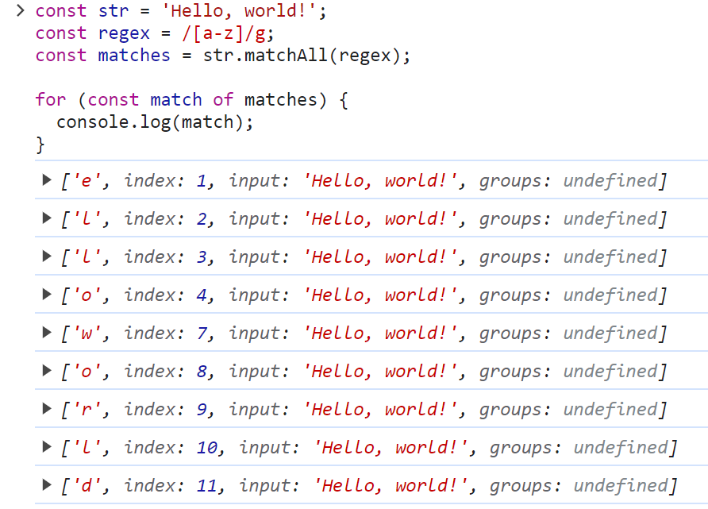
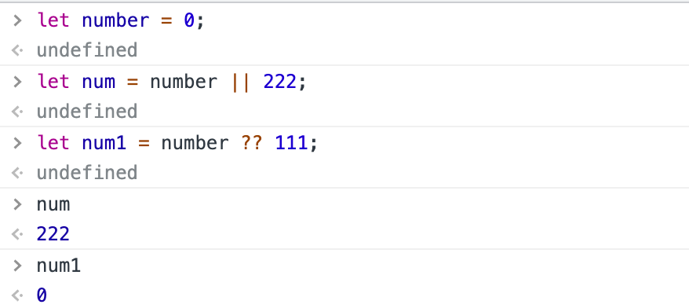

### 常用的新特性

- 变量声明,const,let
- 模板字符串
- 箭头函数
- 解构赋值
- for...in...和for... of...
- class
- 函数设置默认参数
- 数组,字符串,对象的新增方法
- proxy
- promise
- set
- map
- symbol

## ECMAScript 2015(ES6)

1. let和const
2. 类（class）
3. 模块化(ES Module)
4. 箭头（Arrow）函数
5. 函数参数默认值
6. 模板字符串
7. 解构赋值
8. 扩展操作符 ...
9. 对象属性简写
10. Promise

## ECMAScript 2016(es2017)

1. Array.prototype.includes()
2. 指数操作符 **

## ECMAScript 2017(es2016)

1. async/await: 异步终极解决方案
2. Object.values()
3. Object.entries()
4. String padding：String.prototype.padStart、String.prototype.padEnd
5. 函数参数列表结尾允许逗号
6. Object.getOwnPropertyDescriptors(): 获取一个对象的所有自身属性的描述符,如果没有任何自身属性，则返回空对象
7. SharedArrayBuffer 对象：用来表示一个通用的，固定长度的原始二进制数据缓冲区
8. Atomics 对象：提供了一组静态方法用来对 SharedArrayBuffer 对象进行原子操作

### Object.getOwnPropertyDescriptors()

```js
const obj = {
  name: 'Alice',
  age: 25
};

const descriptors = Object.getOwnPropertyDescriptors(obj);
console.log(descriptors);
//输出结果为
{
  name: {
    value: 'Alice',
    writable: true,
    enumerable: true,
    configurable: true
  },
  age: {
    value: 25,
    writable: true,
    enumerable: true,
    configurable: true
  }
}
```

## ECMAScript 2018(es2017)

1. 异步迭代：await可以和for...of循环一起使用，以串行的方式运行异步操作
2. Promise.finally()
3. Rest/Spread 属性：允许我们将一个剩余参数表示为一个数组
4. 正则表达式命名捕获组：允许命名捕获组使用符号`?<name>`
5. 正则表达式反向断言(lookbehind)
6. 正则表达式dotAll模式：正则表达式中点.匹配除回车外的任何单字符，标记s改变这种行为，允许行终止符的出现
7. 正则表达式 Unicode 转义: Unicode 属性转义形式为`\p{...}`和`\P{...}`

### 异步迭代

```js
async function process(array) {
  for (let i of array) {
    await doSomething(i);
  }
}
async function process(array) {
  for await (let i of array) {
    doSomething(i);
  }
}
```

注意这两种写法的不同之处:

第一种写法使用了普通的 for 循环和 await 关键字。在每次循环迭代时，doSomething(i) 方法会被等待执行完成，然后再进行下一次循环迭代。这意味着，在执行 doSomething(i) 的过程中，整个循环会被暂停，直到 doSomething(i) 执行完成才会继续下一次迭代。这样可以确保按顺序依次执行 doSomething(i)。

第二种写法使用了 for await...of 循环。在每次循环迭代时，不会等待 doSomething(i) 方法的完成，而是直接进行下一次迭代。这意味着，在并发执行 doSomething(i) 的过程中，循环会继续进行下一次迭代，不会被阻塞。这样可以实现并发执行 doSomething(i)。

如果需要保证按顺序执行，并且每次迭代都依赖上一次迭代的结果，那么使用第一种写法。如果每次迭代之间的顺序不重要，可以并发执行，那么可以使用第二种写法来提高执行效率。

### 正则表达式命名捕获组：允许命名捕获组使用符号`?<name>`

```js
const regex = /(?<year>\d{4})-(?<month>\d{2})-(?<day>\d{2})/;

const match = regex.exec('2022-01-01');
console.log(match.groups.year);  // 输出: 2022
console.log(match.groups.month); // 输出: 01
console.log(match.groups.day);   // 输出: 01

```

### 正则表达式反向断言(lookbehind)

1. 肯定的反向断言（Positive Lookbehind）：`(?<=...)`。它用于匹配某个位置之前的文本，并且要求该位置之前的文本符合指定的模式。

   示例：`/(?<=\d{3})\d{3}/` 可以匹配 "123456" 中的 "456"，因为它要求 "456" 前面的三个字符是数字。

2. 否定的反向断言（Negative Lookbehind）：`(?<!...)`。它用于匹配某个位置之前不符合指定模式的文本。

   示例：`/(?<!\d)\d{3}/` 可以匹配 "123" 中的 "123"，因为它要求 "123" 前面的字符不是数字。

**先行断言**有两种类型：肯定的先行断言（Positive Lookahead）和否定的先行断言（Negative Lookahead）。

1. 肯定的先行断言（Positive Lookahead）：`(?=...)`。它用于匹配某个位置之后的文本，并且要求该位置之后的文本符合指定的模式。

   示例：`/\d+(?=%)/` 可以匹配 "123%" 中的 "123"，因为它要求 "123" 后面的字符是 "%"。

2. 否定的先行断言（Negative Lookahead）：`(?!...)`。它用于匹配某个位置之后不符合指定模式的文本。

   示例：`/\d+(?!%)/` 可以匹配 "123" 中的 "123"，因为它要求 "123" 后面的字符不是 "%"。

### 正则表达式dotAll模式：正则表达式中点.匹配除回车外的任何单字符，标记s改变这种行为，允许行终止符的出现

正则表达式中的 `.` 通常匹配除了换行符之外的任何单个字符。这意味着它无法匹配换行符（回车符）。

但是，通过使用 `s` 标记，也称为 "dotAll" 模式，可以改变这种行为。当 `s` 标记被设置时，正则表达式中的 `.` 将匹配包括换行符在内的任何字符。

下面是一个示例，演示了 `s` 标记的用法：

```javascript
const regex = /hello.world/s;

console.log(regex.test('hello\nworld'));  // 输出: true
console.log(regex.test('hello world'));  // 输出: false
```

在上面的示例中，正则表达式 `/hello.world/s` 匹配了包含换行符的字符串 "hello\nworld"。因此，第一个 `console.log` 输出为 `true`。

需要注意的是，`s` 标记在某些 JavaScript 引擎中可能不被支持，或者支持的方式有所不同。因此，在使用 `s` 标记时，最好先检查目标环境的兼容性。另外，还可以使用 `[\s\S]` 来替代 `.`，以匹配包括换行符在内的任何字符。例如，`/hello[\s\S]world/` 可以达到与 `/hello.world/s` 相同的效果。

### 正则表达式 Unicode 转义: Unicode 属性转义形式为`\p{...}`和`\P{...}`

`\p{...}` 用于匹配符合指定 Unicode 属性的字符。其中 `{...}` 是属性名称，可以是 Unicode 标准定义的属性名称或简写形式。

示例：

- `\p{Letter}` 匹配任何字母字符。
- `\p{Number}` 匹配任何数字字符。
- `\p{Script=Latin}` 匹配任何拉丁字母字符。

`\P{...}` 用于匹配不符合指定 Unicode 属性的字符。

示例：

- `\P{Letter}` 匹配任何非字母字符。
- `\P{Number}` 匹配任何非数字字符。
- `\P{Script=Latin}` 匹配任何非拉丁字母字符。

## ECMAScript 2019(es2018)

1. Array.flat()和Array.flatMap()：数组展平
2. String.trimStart()和String.trimEnd()：去掉开头结尾空格文本
3. String.prototype.matchAll：为所有匹配的匹配对象返回一个迭代器
4. Symbol.prototype.description：只读属性，回 Symbol 对象的可选描述的字符串
5. Object.fromEntries()：返回一个给定对象自身可枚举属性的键值对数组
6. 可选 Catch
7. JSON Superset 超集
8. JSON.stringify() 加强格式转化
9. Array.prototype.sort() 更加稳定
10. Function.prototype.toString() 重新修订

### Array.flatMap()

```js
const arr = [1, 2, 3, 4, 5];
const result = arr.flatMap(num => [num, num * 2]); //数组中的每个元素执行一个映射函数，并将映射结果展平为一个新的数组。

console.log(result); // [1, 2, 2, 4, 3, 6, 4, 8, 5, 10] 嵌套的数组会被平铺
```

### String.prototype.matchAll

这个的作用相当于match()方法在非全局模式下的调用



### Symbol.prototype.description

```js
const symbol = Symbol('This is a Symbol');
symbol;
// Symbol(This is a Symbol)
Symbol.description;
// 'This is a Symbol' 
```

### Object.fromEntries()：返回一个给定对象自身可枚举属性的键值对数组

> 我们知道ES8引入了`Object.entries`把一个对象转为`[key, value]`键值对的形式，可以运用于像 Map 这种结构中。凡事有来有回，`Object.fromEntries()`用于把键值对还原成对象结构。

```js
const entries = [ ['foo', 'bar'] ];
const object = Object.fromEntries(entries);
// { foo: 'bar' }
```

## ECMAScript 2020(es2019)

1. 动态 import ()：按需导入
2. 空值合并运算符：表达式在 ?? 的左侧 运算符求值为undefined或null，返回其右侧
3. 可选链接：?.用户检测不确定的中间节点
4. BigInt：新基本数据类型，表示任意精度的整数
5. globalThis：浏览器：window、worker：self、node：global
6. Promise.allSettled：返回一个在所有给定的promise已被决议或被拒绝后决议的promise，并带有一个对象数组，每个对象表示对应的promise结果
7. `for-in` 结构：用于规范`for-in`语句的遍历顺序

### 空值合并运算符（?? ）

可以使用了`??`运算符了，它只有当操作符左边的值是`null`或者`undefined`的时候，才会取操作符右边的值：

```js
let num = number ?? 222
```



而且该运算符也支持**短路特性**：

```js
const x = a ?? getDefaultValue()
// 当 `a` 不为 `undefined` 或 `null` 时，`getDefaultValue` 方法不会被执行
```

但需要注意一点，该运算符不能与 AND 或 OR 运算符共用，否则会抛出语法异常：

```js
a && b ?? "default"    // SyntaxError
```

### BigInt

有两种使用方式：1、在数字字面量的后面添加后缀`n`；2、使用其构造函数`BigInt`

```js
const bigInt = 9007199254740993n
const bigInt = BigInt(9007199254740992)

// 在超过 Number 最大整数限制时，我们也可以改为传入一个可能被正确解析的字符串
const bigInt = BigInt('9007199254740993')
```

但因为 BigInt 是纯粹的整数类型，无法表示小数位，因此 BigInt 的除法运算（`/`）的结果值依然还是一个整数，即向下取整：

```js
const bigInt = 3n;
bigInt / 2n;    // => 1n，而不是 1.5n
```

BigInt 可以和字符串之间使用`+`运算符连接

```js
1n + ' Number'   // => 1 Number
'Number ' + 2n   // => Number 2
```

下面这些场景不支持使用BigInt：

1、BigInt 无法和 Number 一起运算，会抛出类型异常

```js
1n + 1
// Uncaught TypeError: Cannot mix BigInt and other types, use explicit conversions
```

2、一些内置模块如 Math 也不支持 BigInt，同样会抛出异常

```js
Math.pow(2n, 64n)
// Uncaught TypeError: Cannot convert a BigInt value to a number
```

3、BigInt 和 Number 相等，但并不严格相等，但他们之间可以比较大小

```js
1n == 1    // => true
1n === 1   // => false
```

但他们之间是可以比较大小的：

```js
1n < 2     // => true
1n < 1     // => false

2n > 1     // => true
2n > 2     // => false
```

而且在转换为 Boolean 值时，也和 Number 一样，`0n` 转为 `false`，其它值转为 `true`：

```js
!!0n       // => false
!!1n       // => true
```

另外两者之间只能使用对方的构造函数进行转换：

```js
Number(1n) // => 1
BigInt(1)  // => 1n
```

但两者之间的转换也都有一些边界问题：

```js
// 当 BigInt 值的精度超出 Number 类型可表示的范围时，会出现精度丢失的问题
Number(9007199254740993n)
// => 9007199254740992

// 当 Number 值中有小数位时，BigInt 会抛出异常
BigInt(1.1)
// VM4854:1 Uncaught RangeError: The number 1.1 cannot be converted to a BigInt because i
```

## ECMAScript 2021 (es2020)

1. [String.prototype.replaceAll](https://link.zhihu.com/?target=https%3A//link.juejin.cn/%3Ftarget%3Dhttps%3A%2F%2F262.ecma-international.org%2F12.0%2F%23sec-string.prototype.replaceall) ：有了这个 API，替换字符不用写正则了
2. [Promise.any()](https://link.zhihu.com/?target=https%3A//link.juejin.cn/%3Ftarget%3Dhttps%3A%2F%2F262.ecma-international.org%2F12.0%2F%23sec-promise.any) ：返回第一个 fullfilled 的 promise ，若全部 reject，则返回一个带有失败原因的 AggregateError。
3. 新增逻辑赋值操作符： ??=、&&=、 ||=
4. [WeakRefs](https://link.zhihu.com/?target=https%3A//link.juejin.cn/%3Ftarget%3Dhttps%3A%2F%2F262.ecma-international.org%2F12.0%2F%23sec-weak-ref-objects)：使用弱引用对象，该弱引用不会阻止 GC，并且可以在 GC 前使用 WeakRef.prototype.deref ( ) 解除该引用。
5. 下划线 (_) 分隔符：使用 _ 分隔数字字面量以方便阅读
6. Intl.ListFormat ：用来处理和多语言相关的对象格式化操作
7. Intl.DateTimeFormat API 中的 dateStyle 和 timeStyle 的配置项：用来处理多语言下的时间日期格式化的函数

### replaceAll

模式的所有匹配都会被替代项替换。模式可以是字符串或正则表达式，而替换项可以是字符串或针对每次匹配执行的函数。并返回一个全新的字符串

```js
const str = "student is a real student";
const newStr = str.replace(/student/g, "hahaha");
console.log(newStr); 
```

```js
const str = "student is a real student";
const newStr = str.replaceAll('student', "hahaha");
console.log(newStr); 
```

### 新增逻辑赋值操作符

```text
// 等同于 a = a || b
a ||= b;
// 等同于 c = c && d
c &&= d;
// 等同于 e = e ?? f
e ??= f;
```

### 下划线 (_) 分隔符

数字太长会导致可读性很差。使用了数字分隔符 `_` （下划线），就可以让数字读的更清晰：

```js
let x = 2_3333_3333
// x 的值等同于 233333333，只是这样可读性更强，不用一位一位数了
```

## ECMAScript 2022(es2021)提案阶段，更倾向于面向对象

1. 声明类的字段：类字段可以在类的顶层被定义和初始化
2. 私有方法&字段：用`#前缀`来定义类的私有方法和字段
3. 类的静态公共方法和字段：增加了`静态公共字段`、`静态私有方法`和`静态私有字段`的特性
4. ECMScript 类静态初始化块：在类声明/定义期间评估静态初始化代码块，可以访问类的私有字段
5. 检测私有字段：可以使用in操作符，如果指定的属性/字段在指定的对象/类中，则返回真，并且也能判断私有字段
6. 正则匹配索引：该提案提供了一个新的`/d`flag，以获得关于输入字符串中每个匹配的开始和索引位置结束的额外信息
7. 在所有内置的可索引数据上新增.at()方法
8. Object.hasOwn(object, property)：使用 Object.hasOwn 替代 Object.prototype.hasOwnProperty.call
9. Error Cause：为了便捷的传递导致错误的原因

未完成

https://zhuanlan.zhihu.com/p/427857918