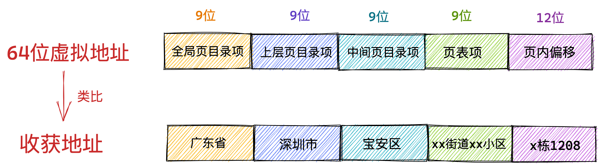
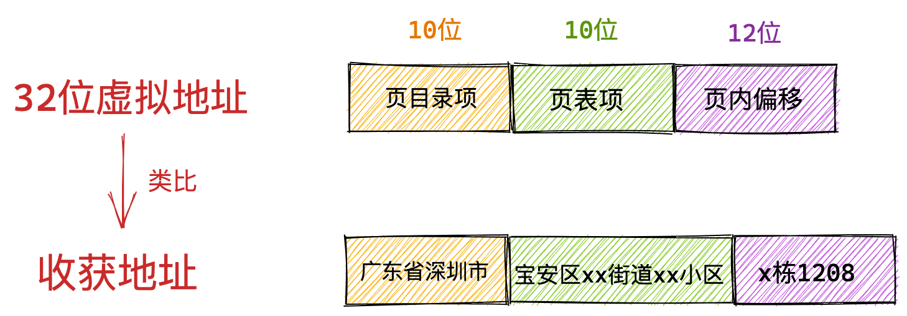

进程无论是在用户态还是在内核态能够看到的都是虚拟内存空间，物理内存空间被操作系统所屏蔽进程是看不到的。

进程通过虚拟内存地址访问这些数据结构的时候，虚拟内存地址会在内存管理子系统中被转换成物理内存地址，通过物理内存地址就可以访问到真正存储这些数据结构的物理内存了。

### 1. 到底什么是虚拟内存地址

虚拟地址可以人为的变来变去，但是物理地址永远是不变的。

 Intel Core i7 处理器为例，64 位虚拟地址的格式为：全局页目录项（9位）+ 上层页目录项（9位）+ 中间页目录项（9位）+ 页表项（9位）+ 页内偏移（12位）。共 48 位组成的虚拟内存地址。

32 位虚拟地址的格式为：页目录项（10位）+ 页表项（10位） + 页内偏移（12位）。共 32 位组成的虚拟内存地址。

###  2. 为什么要使用虚拟地址访问内存

程序局部性原理表现为：时间局部性和空间局部性。时间局部性是指如果程序中的某条指令一旦执行，则不久之后该指令可能再次被执行；如果某块数据被访问，则不久之后该数据可能再次被访问。空间局部性是指一旦程序访问了某个存储单元，则不久之后，其附近的存储单元也将被访问。

根据程序局部性原理，在某一段时间内，进程真正需要的物理内存其实是很少的一部分，我们只需要为每个进程分配很少的物理内存就可以保证进程的正常执行运转。

每个进程都拥有自己独立的虚拟地址空间，进程与进程之间的虚拟内存地址空间是相互隔离，互不干扰的。这样一来我们就可以将多进程之间协同的相关复杂细节统统交给内核中的内存管理模块来处理，极大地解放了程序员的心智负担。这一切都是因为虚拟内存能够提供内存地址空间的隔离，极大地扩展了可用空间。

任何一个虚拟内存里所存储的数据，本质上还是保存在真实的物理内存里的。只不过内核帮我们做了虚拟内存到物理内存的这一层映射，将不同进程的虚拟地址和不同内存的物理地址映射起来。

### 3. 进程虚拟内存空间