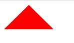
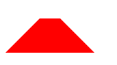

### 三角形

```html
<style>
        .triangle {
            width: 0;
            height: 0;
            border-left: 50px solid transparent;
            border-right: 50px solid transparent;
            border-bottom: 50px solid red;
        }
    </style>
<body>
    <div class="triangle"></div>
</body>
```



### 梯形

```js
<style>
        .triangle {
            width: 30px;
            height: 30px;
            border-left: 50px solid transparent;
            border-right: 50px solid transparent;
            border-bottom: 50px solid red;
        }
    </style>
<body>
    <div class="triangle"></div>
</body>
```



就是给盒子本身加上了长和宽

