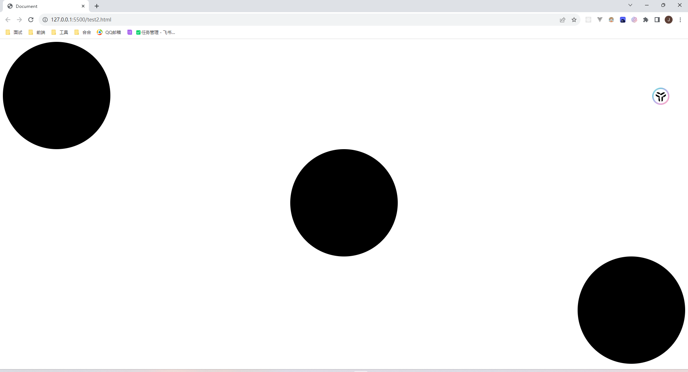

重点是主轴改成column,然后通过`slign-self`属性可以修改item自身在交叉轴上的位置

```html
<!DOCTYPE html>
<html lang="en">

<head>
  <meta charset="UTF-8">
  <meta name="viewport" content="width=device-width, initial-scale=1.0">
  <title>Document</title>
  <style>
    div {
      /* 使用Flex布局 */
      display: flex;
      /* 两端对齐 */
      justify-content: space-between;
      /* 垂直排列 */
      flex-direction: column;
      width: 100%;
      height: 100%;
    }

    .item {
      width: 300px;
      height: 300px;
      border-radius: 50%;
      background-color: #000;
    }

    .item:nth-child(2) {
      /* 第二项居中对齐 */
      align-self: center;
    }

    .item:nth-child(3) {
      /* 第三项结尾对齐 */
      align-self: flex-end;
    }
  </style>
</head>

<body>
  <div>
    <div class="item"></div>
    <div class="item"></div>
    <div class="item"></div>
  </div>
</body>

</html>
```

