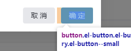
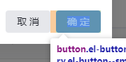

并排放的inline-block有个查不到的边距,常见于并排放的按钮

例如



最简单的解决方法

两个元素在代码中不换行

例如这样

```vue
    <el-button @click="dialogVisible = false" size='small'>取 消</el-button><el-button type="primary" @click="dialogVisible = false" size='small'>确 定</el-button>

```

效果



但是不会有人真这么写代码吧,不会吧

所以依然不优雅的解决办法

父元素设置`font-size:0`

子元素再设置正常的`font-size`