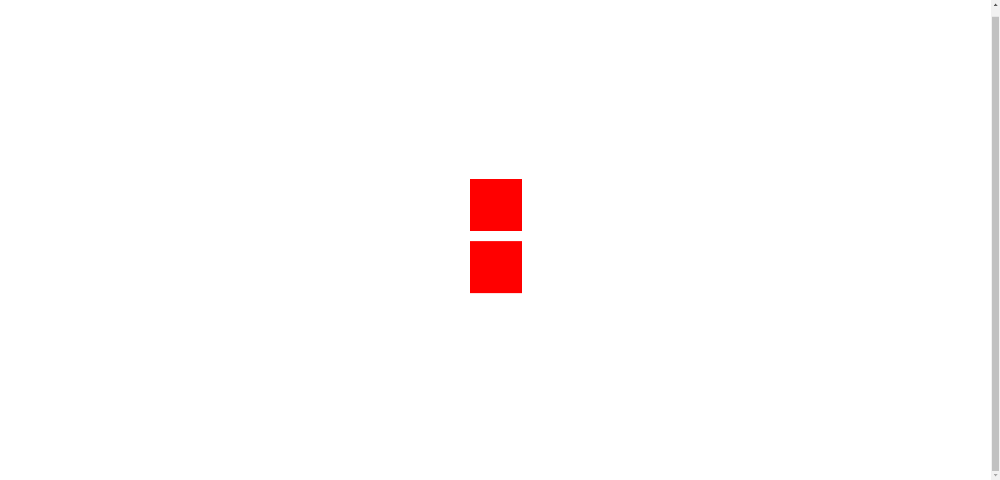

###  两个元素上下居中 水平对称

来自gpt的demo

```html
<!--
 * @Author: xiangyue_li
 * @Date: 2023-07-19 21:39:12
 * @LastEditors: xiangyue_li
-->
<!doctype html>
<html lang="en">

<head>
    <meta charset="UTF-8">
    <meta name="viewport"
        content="width=device-width, user-scalable=no, initial-scale=1.0, maximum-scale=1.0, minimum-scale=1.0">
    <meta http-equiv="X-UA-Compatible" content="ie=edge">
    <title>Document</title>
    <style>
        .container {
            display: flex;
            flex-direction: column;
            justify-content: center;
            align-items: center;
            height: 100vh;
            /* 设置容器高度为视口高度 */
        }

        .box {
            width: 100px;
            height: 100px;
            background-color: red;
            margin: 10px;
        }

        .box:first-child {
            margin-top: auto;
            /* 将第一个子元素的上边距设为 auto，实现上下居中 */
        }

        .box:last-child {
            margin-bottom: auto;
            /* 将最后一个子元素的下边距设为 auto，实现上下居中 */
        }
    </style>
</head>

<body>
    <div class="container">
        <div class="box"></div>
        <div class="box"></div>
    </div>

</body>

</html>
```

### 效果图

