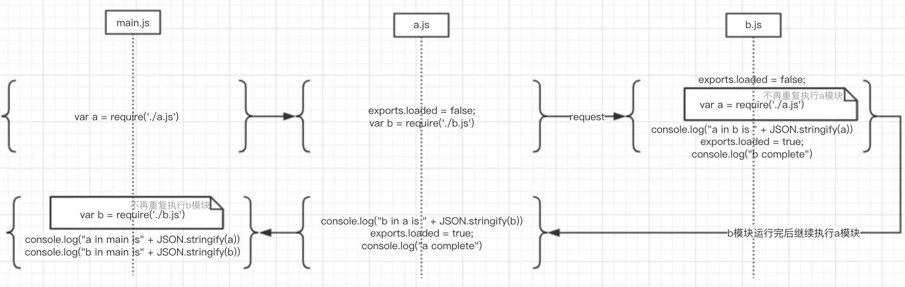

1. `import` 是 ES6 中引入模块的语法，而 `require` 是 Node.js 中引入模块的语法。
2. **`import` 是编译时引入，而 `require` 是运行时引入**。也就是说，使用 `import` 时，模块会在编译时被解析和加载，编译器可以在编译时知道需要引入的模块，从而进行一些优化操作，例如代码压缩和摇树优化（tree shaking），减少最终打包的文件大小。而使用 `require` 时，模块会在代码运行时被加载。
3. `import` 引入的模块是静态的，而 `require` 引入的模块是动态的。在使用 `import` 时，模块的路径必须是静态的，不能使用变量；而在使用 `require` 时，模块的路径可以是动态的，可以使用变量。
4. `import` 引入的模块是只读的，而 `require` 引入的模块是可读可写的。在使用 `import` 时，引入的模块是只读的，不能修改其导出的变量；而在使用 `require` 时，引入的模块是可读可写的，可以修改其导出的变量。
5. **`import` 可以按需加载模块，而 `require` 加载的是整个模块。** 在使用 `import` 时，可以使用动态 `import` 的方式，按需加载模块；而在使用 `require` 时，会将整个模块加载到内存中。


### CommonJS 和 ES Module 的区别

- 加载方式不同：CommonJS 是运行时加载，ES Module 是编译时加载；
- 输出方式不同：CommonJS 输出的是一个值的拷贝，ES Module 输出的是值的引用；
- 声明方式不同：CommonJS 使用 module.exports 和 require 来导出和导入模块，ES Module 使用 export 和 import 来导出和导入模块。


### a.js和b.js两个文件循环引入会不会死循环

### commonJS的循环引用运行机制

```js
// a.js
exports.loaded = false;
var b = require('./b.js')
console.log("b in a is " + JSON.stringify(b))
exports.loaded = true;
console.log("a complete")

```

```js
// b.js
exports.loaded = false;
var a = require('./a.js')
console.log("a in b is " + JSON.stringify(a))
exports.loaded = true;
console.log("b complete")

```

```js
// main.js
var a = require('./a.js')
var b = require('./b.js')

console.log("a in main is" + JSON.stringify(a))
console.log("b in main is" + JSON.stringify(b))
```

执行指令`nodejs main.js`

时序图下的执行步骤分解图如下所示：



### ES6的循环引用运行机制

```js
// a.mjs
import { bar } from './b.mjs'

console.log(bar());
export function foo() {
    return 'foo from a.mjs'
}

```

```js
// b.mjs
import { foo } from './a.mjs'
console.log(foo());
export function bar() {
    return 'bar from b.mjs'
}

```

```js
// main.mjs
import { foo } from './a.mjs'
import { bar } from './b.mjs'

```

