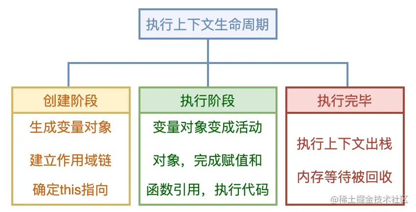

js代码在浏览器中运行时,解释器执行代码到调用函数时,被调用的函数加入**调用栈**

创建对应这个函数的**执行上下文**

这个有个新问题,调用栈是否等于我认为的执行栈?

当一个执行上下文入栈时,它有两个生命周期,**创建阶段和执行阶段**

- 创建阶段:
  - 生成**变量对象(Variable Object)**
  - 建立作用域链
  - 确定函数中的`this`指向
- 执行阶段
  - **变量对象变成活动对象**,变量赋值
  - 函数引用
  - 执行其他代码

执行阶段完毕,执行上下文出栈,内存回收

### 变量对象(Variable Object)VO

在执行上下文的创建阶段,会创建变量对象,包括下面三个内容

1. 创建函数的**arguments对象**.检查当前上下文中的参数,建立该对象下的属性和属性值,没有实参的话,属性值为undefined
2. 在函数内部的**函数声明**,会在变量对象中以函数名建立一个属性,属性值为指向该函数内存地址的引用,同名函数会被后面的覆盖
3. 函数内部的**变量声明**,同样在变量对象中以变量名建立一个属性,**但是属性值为undefined**

**创建变量对象的过程其实就是变量提升和函数提升的过程!**

**这里也体现了为什么函数提升在变量提升之前**

### 活动对象(Activation Object)AO

在执行上下文进入执行阶段之后,**变量对象变成活动对象**

变量对象和活动对象是同一个对象,只是在不同生命周期之内

