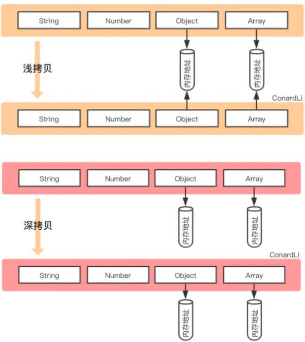

浅拷贝和深拷贝的区别体现在引用类型上

### 浅拷贝

基本类型复制的就是基本类型的值

引用类型就只复制了指向对象的引用

复制前后**两个引用都指向堆中同一个对象**

此时任一引用对对象进行修改会影响到另一引用

### 深拷贝

基本类型还是一样的

但引用类型所指向的对象也会复制一份

**但复制出来的引用不再指向原对象,而是指向新生成的对象**

此时任一引用对对象的修改不会影响另一引用




### 常见浅拷贝

- Object.assign
- Array.prototype.slice()
- Array.prototype.concat()
- 拓展运算符

```js
const fxArr = ["One", "Two", "Three",[111]]
const fxArrs = fxArr.slice(0)
fxArrs[1] = "love";
fxArrs[3][0] = "love";
console.log(fxArr) // [ 'One', 'Two', 'Three', [ 'love' ] ]
console.log(fxArrs) // [ 'One', 'love', 'Three', [ 'love' ] ]
```

**注意这里浅拷贝的主体是数组,它本身就在堆中,而不是栈中的fxArr这个引用值**

**确定拷贝的主体是啥很重要**


### 常见深拷贝

- _.cloneDeep()
- jQuery.extend()
- **JSON.stringify()**