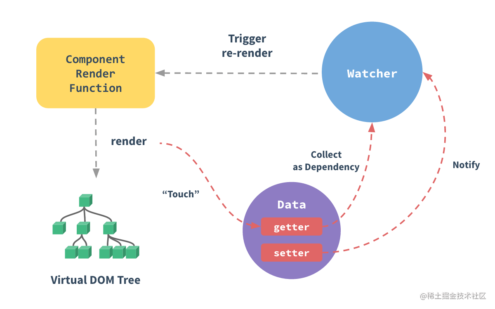

Vue2响应式主要是`Observer,Dep,Watcher`三部分的通信

### Observer

实例化Observer时,遍历对象(即data),通过`defineReactive`函数,给每个属性添加getter和setter

这一步是在beforeCreate和created两个钩子之间执行的

defineReactive中会实例化一个Dep,Dep用来收集Watcher

当属性的getter被触发时,当前Watcher(组件)(Dep.target)会被收集到Dep中

Dep.target是一个静态属性,组件实例化时会修改Dep.target指向当前的组件

一个Watcher就是一个组件

当属性setter被触发时,对应的Dep会调用notify()方法通知Dep中收集的Watcher

### Dep

就是用来收集Watcher,通知Watcher

### Watcher 

每个组件对应一个renderWatcher(Watcher)

当组件挂载的时候new Watcher,Watcher中的get方法会将Dep.target指向当前的组件

因此Vue的每次更新都是以组件为单位,diff算法也是以组件为单位进行对比

**这也是组件只能有一个根元素的原因**

**Watcher主要作用是进行组件的更新**,Watcher中有一个update方法,

数据改变时,对应的setter函数调用,该响应式数据对应的Dep调用`notify`方法

该方法会遍历调用Dep收集的Watcher中的update方法去更新对应的组件