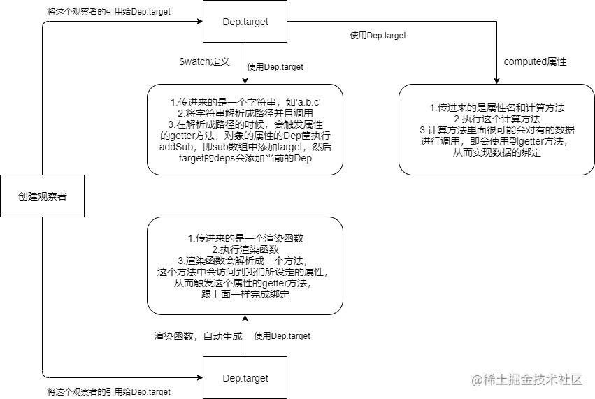

### watch实现原理

- $watch中new Watcher,这个watcher被称为用户watcher
- get()方法调用,将`Dep.target`指向当前的user-watcher
- parsePath()方法调用,这里先对`path`也就是`a.b.c`解析成一个数组['a','b','c']
- 然后遍历数组去触发对应的数据劫持,这里可以注意到修改a,b,c中的任意一个都会触发
- 数据劫持的过程中,在get时,将当前user-watcher收集到数据的Dep中
- 当数据更新时,set中会调用dep.notify,这个方法会调用dep中保存的Watcher的update方法

### computed实现原理

- 给computed属性创建Watcher(computed-watcher)
- 将这个Watcher添加到computed属性使用了的响应式数据的Dep中
- computed属性值的变化来自data中属性的变化,要想使用了computed属性的模板跟着变化,就得把对应的render-watcher添加到与computed属性相关的data属性的Dep中

### 具体流程

render函数执行时,触发了computed属性的get

在get中依次做了几件事:

- 执行computed属性函数,将函数返回值保存起来

​	注意,执行computed函数的过程中,data属性值被get了.

- data属性值把当前的computed属性的watcher添加到订阅队列中
- data属性值把render-watcher添加到订阅队列中
- 返回保存起来的computed函数执行结果

https://juejin.cn/post/6844904128435453966

参考文章

### 两者的区别

watch实现是通过遍历获取属性,触发数据劫持实现响应式

computed是使用到了这个属性,触发的数据劫持

watch收集依赖是在页面渲染之前,computed是在页面渲染时,因为这个时候才使用data中的数据去进行数据劫持

**$watch**方法创建的观察者的时候，如果不设定**immediate**属性，那么是不会进行调用的，而**computed**和**render**是会进行调用方法的。

**$watch**和**computed**观察者是在**created**生命钩子函数前就创建完毕并且绑定的，而**render**观察者是在**mounted**之前创建并绑定的，所以同一个组件中，**render**观察者的**id**会大于其他观察者（**id**是在后面执行队列里面升序排序的时候的依据）。 **换句话说，在同一个组件的观察者中，当数据发生改变的时候，渲染函数观察者一定是最后执行的。** 这个很好理解，其他观察者中难免会对数据进行修改，如果渲染函数观察者先执行了，然后其他观察者对数据进行改变的话，那么没办法将数据准确呈现在页面上，导致数据不一致性。

### Dep和Watcher的关系

数据的**Dep**的**subs**数组存放这个数据所绑定的观察者对象，观察者对象的**deps**数组中存放着与这个观察者有关的数据**Dep**。所以数据的**Dep**与**Watcher**其实是多对多关系
