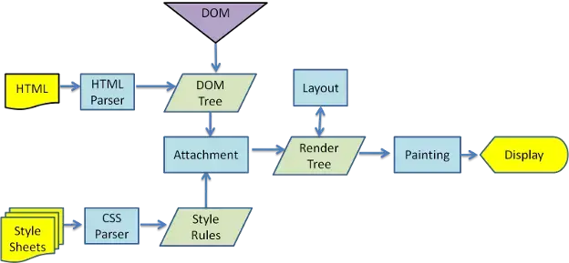

1. 效率：虚拟DOM可以在内存中进行操作，而不需要直接操作真实的DOM。当应用程序状态发生变化时，虚拟DOM可以对比前后两个状态的差异，并且只更新需要变化的部分，然后批量更新真实DOM。这样可以减少对真实DOM的直接操作，提高页面渲染的效率。
1. 跨平台：虚拟DOM可以在不同平台上使用，如浏览器、移动设备、服务器等。这意味着可以使用相同的代码库来构建跨平台的应用程序。
1. 组件化开发：虚拟DOM与组件化开发相结合，可以将应用程序拆分成多个独立的组件，每个组件管理自己的状态和视图。当组件的状态发生变化时，虚拟DOM可以高效地更新组件的视图，而不需要重新渲染整个页面。
1. 简化开发：通过使用虚拟DOM，开发者可以将精力集中在业务逻辑上，而不需要过多地关注DOM操作的细节。虚拟DOM可以提供一种声明式的方式来描述页面的状态和行为，使得代码更加清晰和可维护。

### 真实`DOM`和其解析流程

所有的浏览器渲染引擎工作流程大致分为5步：创建 `DOM` 树 —> 创建 `Style Rules` -> 构建 `Render` 树 —> 布局 `Layout` -—> 绘制 `Painting`。

**注意点：**

1. **`DOM` 树的构建是文档加载完成开始的？** 构建 `DOM` 树是一个渐进过程，为达到更好的用户体验，渲染引擎会尽快将内容显示在屏幕上，它不必等到整个 `HTML` 文档解析完成之后才开始构建 `render` 树和布局。
2. **`Render` 树是 `DOM` 树和 `CSS` 样式表构建完毕后才开始构建的？** 这三个过程在实际进行的时候并不是完全独立的，而是会有交叉，会一边加载，一边解析，以及一边渲染。
3. `CSS` 的解析是从右往左逆向解析的，嵌套标签越多，解析越慢。

### `Virtual-DOM` 基础

