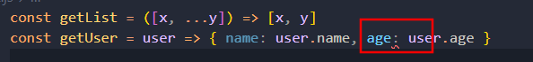

```js
const getList = ([x, ...y]) => [x, y]
const getUser = user => { name: user.name, age: user.age }

const list = [1, 2, 3, 4]
const user = { name: "Lydia", age: 21 }

console.log(getList(list))
console.log(getUser(user))
```

这里题目第一眼看上去没问题,而且由于第一行代码的遮掩

导致后面惯性思维了

```js
const getUser = user => { name: user.name, age: user.age }
//是相当于
const getUser = user => {
    name:user.name,
    age: user.age
}
```

**这样一看就知道是没有返回值的**

**且在IDE中会直接有错误提示**



想达到预期效果得加个括号

```js
const getUser = user => ({ name: user.name, age: user.age })
```

