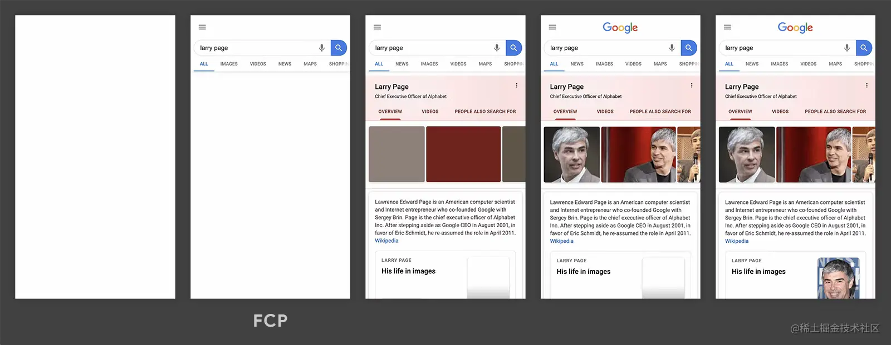

### 页面接收首字节时长:TTFB(time to first byte)

监测方法:

```js
let t = performance.timing
let ttfb =  t.responseStart - t.navigationStart
```

### 首屏加载时间

首屏有图的情况下建议

> 首屏图片最晚加载时间 - t.navigationStart

没图的情况

```js
t.domInteractive - t.navigatorStart
```

### DomReady时间

> 只算处理dom的时间：t.domComplete - t.responseEnd

> 从最开始计算：t.domComplete - t.navigatorStart

### 页面完全加载时间

```js
t.loadEventStart - t.navigationStart
```

### FP (First paint)

FP是首次绘制的意思，常常被用来衡量白屏时间。这个指标要注意的是首次绘制这个概念

### FCP(**First Contentful Paint**)

> “首次内容绘制 (FCP) 指标测量页面从开始加载到页面内容的任何部分在屏幕上完成渲染的时间。对于该指标，"内容"指的是文本、图像（包括背景图像）、`<svg>`元素或非白色的`<canvas>`元素。”

Google建议这个值控制在**1.8 秒**以内。


FP和FCP的区别,一个是第一次渲染,一个是第一次内容渲染完成

如果因为css或者其他原因导致了阻塞,那么就会出现页面结构但是没有内容的情况

**这是因为首次内容渲染还没完成**



### LCP（**Largest Contentful Paint**）

> 最大内容绘制 (LCP) 指标会根据页面首次开始加载的时间点来报告可视区域内可见的最大图像或者文本块完成渲染的相对时间。


