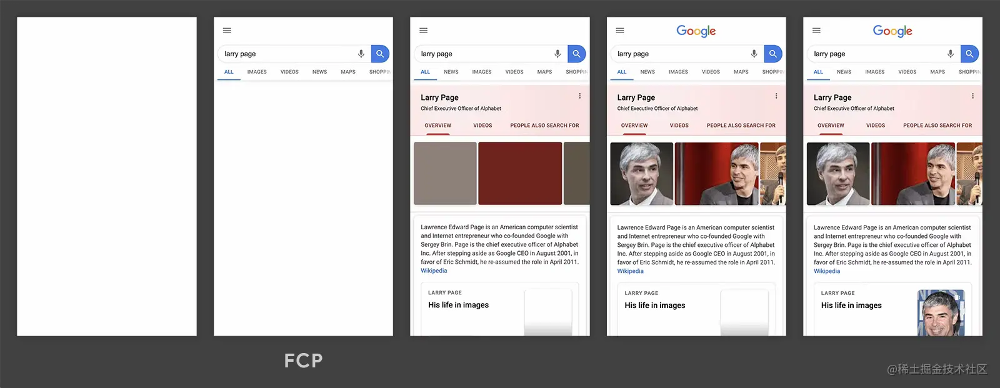

### 页面接收首字节时长:TTFB(time to first byte)

监测方法:

```js
let t = performance.timing
let ttfb =  t.responseStart - t.navigationStart
```

### 首屏加载时间

首屏有图的情况下建议

> 首屏图片最晚加载时间 - t.navigationStart

没图的情况

```js
t.domInteractive - t.navigatorStart
```

### DomReady时间

> 只算处理dom的时间：t.domComplete - t.responseEnd

> 从最开始计算：t.domComplete - t.navigatorStart

### 页面完全加载时间

```js
t.loadEventStart - t.navigationStart
```

### FP (First paint)首次绘制

FP是首次绘制的意思，常常被用来衡量白屏时间。这个指标要注意的是首次绘制这个概念

### FCP(**First Contentful Paint**)首次内容绘制

> “首次内容绘制 (FCP) 指标测量页面从开始加载到页面内容的任何部分在屏幕上完成渲染的时间。对于该指标，"内容"指的是文本、图像（包括背景图像）、`<svg>`元素或非白色的`<canvas>`元素。”

Google建议这个值控制在**1.8 秒**以内。


FP和FCP的区别,一个是第一次渲染,一个是第一次内容渲染完成

如果因为css或者其他原因导致了阻塞,那么就会出现页面结构但是没有内容的情况

**这是因为首次内容渲染还没完成**



### **FMP**（First Meaningful Paint）首次有意义的渲染帧

首次有意义的渲染帧，从页面加载开始，到大部分或者主要内容已经在首屏上渲染的时间点。

### LCP（**Largest Contentful Paint**）最大内容绘制

> 根据页面开始加载的时间报告可视区域内可见的最大图像或文本块完成渲染的计算时间，用于测验加载性能，衡量网站初次载入速度。 我们应该控制该值在**2.5 秒**以内.

最大其实就是指元素的尺寸大小，这个大小不包括可视区域之外或者是被裁剪的不可见的溢出。也不包括元素的Margin / Padding / Border等。

计算包括在内的元素有：

- img 标签元素
- 内嵌在`<svg>`元素内的`<image>`元素
- video 标签元素的封面元素
- 通过 url() 函数加载的带有背景图像的元素
- 包含文字节点的块级元素 或 行内元素

### FID(First Input Delay)首次输入延迟

> 首次输入延迟时间，主要为了测量页面加载期间响应度，测量*交互性*。为了提供良好的用户体验，页面的 FID 应为**100 毫秒**或更短。

就是第一次交互做出响应的时间

### CLS(Cumulative Layout Shift) 累积布局偏移

> 累积布局偏移，测量*视觉稳定性*。为了提供良好的用户体验，页面的 CLS 应保持在 **0.1.** 或更少


