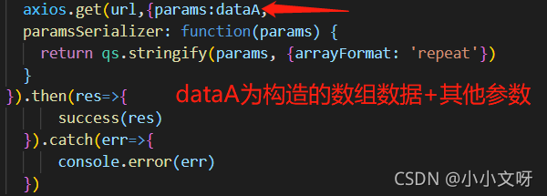

### paramsSerializer序列化

工作中遇到传递给后台参数格式为 ?ids=1&ids=2&ids=3这种**键名相同**形式的数据，需要用到paramsSerializer序列化

1. 传递的数据构造成数组格式

```
ids;[1,2,3]
```

2. 引入qs库

```js
import axios from 'axios';
import qs from 'qs'; //url参数转化（parse和stringify）的js库
```

3. 在axios的请求加入如下代码

```js
paramsSerializer: function(params) {
  return qs.stringify(params, {arrayFormat: 'repeat'})
}

```



**这里也可以在config中统一配置**

**paramsSerializer序列化，处理数组有如下几个形式**

```js
qs.stringify({ids: [1, 2, 3]}, {indices: false})
 //形式：ids=1&ids=2&id=3
qs.stringify({ids: [1, 2, 3]}, {arrayFormat: 'indices'})
 //形式：ids[0]=1&ids[1]=2&ids[2]=3
qs.stringify({ids: [1, 2, 3]}, {arrayFormat: 'brackets'})
 //形式：ids[]=1&ids[]=2&ids[]=3
qs.stringify({ids: [1, 2, 3]}, {arrayFormat: 'repeat'}) 
//形式： ids=1&ids=2&id=3

```

