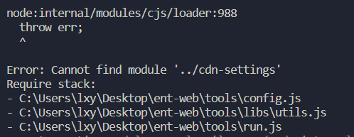
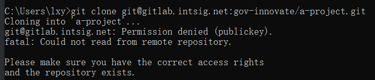
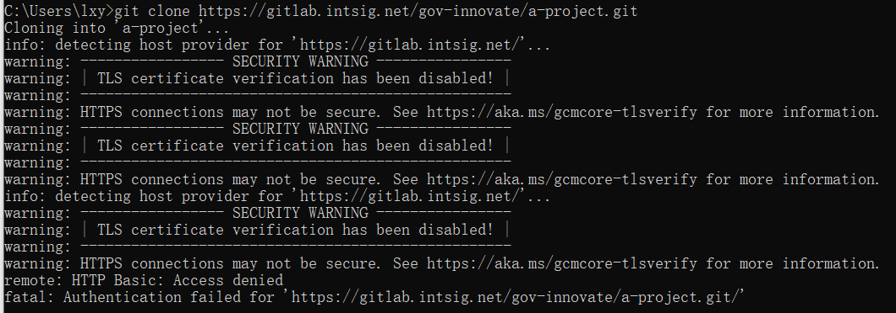

### ent-web项目跑不起来



报错为找不到模块

```
Error: Cannot find module '../cdn-settings'
```

找了一下目录确实没有找到对应文件

搜索之后确定`cdn-settings`被放入忽略文件中,不会上传

**现在不知道怎么跑这个项目**

### 问题解决

先运行命名 npm run cdn


### 项目git clone 一直失败

首先**ssh方式**,在配置了公钥以及多账号不同ssh配置之后

我自己的github账号没有问题可以访问,但gitlab始终失败

一直是许可拒绝



然后**http方式**,成功clone了ent-web这个项目

但PMS还是不行,访问拒绝



**我现在不确定是我配置问题,还是权限上的问题**

