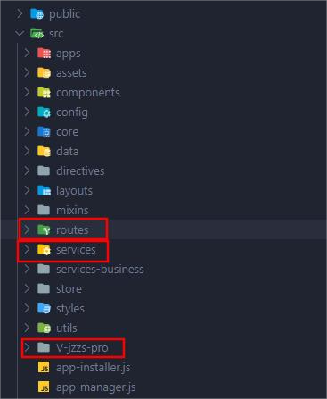
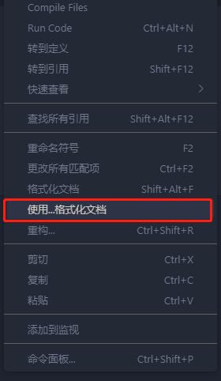
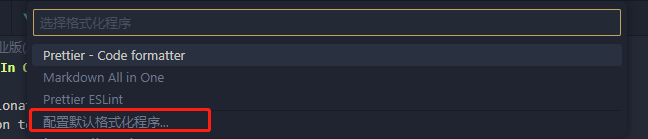

### 项目的安装和启动

首先要注意的是,我们会接触两个gitlab账号

两个账号很相似,clone时注意账号别搞错

安装依赖用的`npm`,node版本是`14.15.0`

npm镜像:`http://npm.qixin007.com/`


#### 安装依赖报错的情况

**`node-sass`安装时会报错**

解决方法:

```
npm i node-sass@4.14.1 --sass_binary_site=https://npm.taobao.org/mirrors/node-sass/
```

这个版本号注意一下,看看`package.json`中是不是这个版本,不是的话,改成package中的版本


#### LF和CRLF问题

这个问题应该是eslint配置的问题,

如果git 设置的是`core.autocrlf = true`,且电脑是windows系统,clone时会使用crlf

eslint配置是要求lf

这就会出现随便打开一个文件都出现大片爆红的问题

解决方法:

git配置可以设置成

```js
git config --global core.autocrlf input
```

这个的效果就是提交时转换成LF,但检出时不转换

VsCode配置:

设置中搜索`files:eol`,改成`\n`

设置好之后,重新clone项目


#### 项目运行方式

先`npm run cdn`生成`cdn-setting.js`文件

然后`npm run start`

项目太大,这里需要一定的时间

### 项目的基本情况

- 基于vue2实现
- 使用组件库 element-ui 和 qxb-web-ui(内部组件库)
- 使用express实现数据转发,解决浏览器跨域问题


#### 常用的几个文件夹




##### routes文件夹

主要是项目之前的业务代码和对应的路由文件,现阶段业务代码不放这里

业务代码之所以也放这里,是之前的规范和现阶段的通用规范不一样的原因

**目前主要在这里进行express接口的配置**


具体配置方法,后面详细讲


##### services文件夹

这里是放所有的接口,这个接口是使用express实现的接口,**不是后端给的实际接口**

**实际接口是express在调用**

前面说过express做了一层数据的转发,这是因为服务器之间不存在跨域问题,express相当于代理服务器的作用


##### V-jzzs-pro文件夹

这个文件夹相当于一个项目的`src`文件夹


src文件夹该有的文件基本都有

这是把项目中**现在在迭代的部分给单独拿出来**,因为之前的代码太多了,不方便查看

前面介绍的两个文件夹中都有`jzzs`这个文件夹,现阶段代码都是在这个文件夹下面

#### 项目常用分支


从上到下分别是:

- 正式环境代码
- 预发布环境代码
- 开发环境代码

### 代码格式化配置

**关闭eslint插件,**

格式化插件使用:

- vue文件使用vetur
- js文件使用Prettier - Code formatter


**切换格式化插件的方式**

鼠标右键





项目中有`eslint-plugin-vue`这个插件,

所以关闭eslint问题不大


### 项目接口引入

拿到接口文档之后,先尝试在接口文档中跑通,确认接口没问题

有些接口需要全局参数,在文档管理中配置

**第一步**


在jzzs文件夹中找到业务模块所对应的文件,一般都是一一对应的关系

如果没有,主动问

找到对应文件,只需要复制一份上面的代码,然后进行修改

这里是express接口配置,调用真实接口


首先看红框,第一个红框是自定义内容(一般直接用接口名)

第二个红框是真实接口path,可以直接从文档中复制过来

**蓝色框是一个关键点,这块内容称为`网关`**

一般情况下可以直接复制文件中上一个接口的网关,但是如果出现404的报错

那就可能是网关错误


#### 判断网关的方法

打开接口文档找到一个已经引入的接口,复制接口到`jzzs`文件夹中搜索

看看这个接口用的网关是啥,那就用啥

**一个文档中的网关用的是同一个**


**第二步**


同样是在`jzzs`文件夹下面,找到对应的文件


这里是相当于使用express转发的接口

这里只需要路径中(也就是第二个红框)使用前面自定义的值就可以了

**但是这里一般都是统一使用同一个**


**第三步**

在文件中调用


这里注意,可以不写错误回调,因为已经统一处理过了


### 开发相关

#### 注意写注释

基本上要添加注释的地方:

- 组件名称
- data数据的含义
- props数据的含义
- 重点方法
- 其他觉得容易引起误会的地方


#### 热更新无效的情况

一般热更新要2~3s,且存在无效的情况,可以刷新页面或者重新打开


#### 自测时注意

在不同状态下进行刷新页面的测试,刷新之后可能会出现问题


### 设计稿相关

设计稿使用figma平台,可以自己用谷歌账号登录,不登录看不到对应的数据


#### 切图方式


找到对应的图层之后,鼠标右键选择图中高亮的位置

然后在放图片的位置新建一个svg文件,把内容粘贴进去

搞不定找UI帮忙


#### 不要直接复制粘贴css代码

一些全局的配置内容,比如字体,不要在代码中重复写(除非确实和全局的不一致)

代码中写的css应该尽量的少,能继承就继承


### 文档相关

**开发应该完全以文档为准!!!**

**写代码之前要仔细看一遍文档中对应的细节!!!**

积极和UI,后端进行沟通,能直接避免很多问题,节省很多时间

主要体现在

- 文档中没有明确要求时,UI稿中存在且实现困难时,完全可以和UI沟通

- 后端一个接口返回多个模块数据时,应该积极沟通,让后端分成不同接口

  

