## 前言

本次分享是关于chatgpt在学习和工作中的一些使用技巧,主要是基于gpt-3.5的一些使用经验

整体分为几个部分

- 为什么使用gpt
- 账号获取
- 使用方式
- 应用技巧
- 相关工具推荐

## 为什么使用gpt

### 1. 交互式对话

gpt实现了真正意义上的人与ai的对话,我觉得它最强大的地方就是可以**读取上下文内容**,这样我们可以实现追问的效果

通过不断的补充新的内容,从而获得我们想要的数据或信息

想想我们使用搜索引擎的时候碰到的问题,当一个问题好不容易找到一个可能的答案,但是在答案中又出现了第二个问题,

这个时候我们只能去重新搜索,得到的答案是第二个问题的答案,它可能和我们最开始的问题毫不相关,这就需要我们自己去联系,结合两个问题得到答案

但是gpt能帮我们解决这个联系的工作,能够实现始终围绕最初的问题给出回答

### 2.回答匹配度高

在chatgpt之前,所谓的智能助手,更多的是通过关键字回答特定的内容

就像搜索引擎是根据关键字匹配结果一样

这两种情况只要问的问题深入一些,基本上找不到相关的内容

**但是gpt在这方面能够做的更好,虽然会有一本正经胡说八道的情况**

但是这个可以自己验证一下答案,或者追问一句,"你确定吗",看看第二次回答的结果

### 3.代码能力强

在gpt之前的ai更多的是概念类的百科全书,能根据关键词给出概念,或者是文学创作方面的能力

gpt在代码能力上,是可以作为参考,或者快速解决一些简单的bug,或者完成一些重复性的代码编写工作

其实很多人觉得gpt将会取代程序员,我还是比较乐观的,至少目前来看,我觉得它对程序员的助力会更大

目前gpt的代码能力肯定是不如在座的各位,而且程序员肯定是最会用gpt的一类人

使用gpt提高我们的效率,就可以把更多的精力放在提升自己上


## 账号获取

### 自己申请

我申请账号比较早,当时申请是只需要一个邮箱和一个境外手机号

邮箱要求不高,我用qq邮箱都可以申请

主要是境外手机账号这一块

可以通过一个在线网站获取境外的虚拟手机号

[获取虚拟手机号码。短期手机号码。手机短信激活服务 (sms-activate.org)](https://sms-activate.org/cn/getNumber#)


这个成本也低,只要几块钱

这方面就不细说了,网上有很多相关教程

### 购买成品号

还有个更简单的方式,直接购买成品号

这里也提供购买方式,现在都很便宜,只要几块钱

https://www.77zhanghao.com/baidu/2023-02-13/2994.html

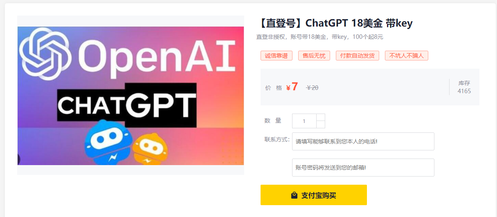

重点是付款方便,可以直接支付宝

## 使用方式

因为现在openAI对中国的封禁力度有点大,所以有了账号之后使用上也是困难重重

接下来我会推荐几个目前还能用的比较好的使用方式

### 直接访问官网

官网登录是需要梯子(vpn)通过欧美节点才可以登录的,东亚这边所有国家的节点都登录不了.他这里是有ip限制的

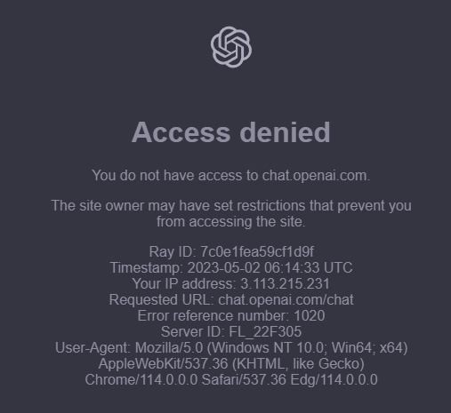

我们公司提供的代理服务器应该是日本的,同样是无法登录的

通过欧美节点成功登录之后,是可以使用了,但是因为节点距离我们比较远的问题,还有使用人数的问题,

经常是问一个问题就会网络错误,只能重新刷新页面


这时候有个小技巧,登录之后可以切换节点到离得近网速快的节点

因为他只是登录时做了ip限制,在使用时没有这个限制了

### 使用api key访问

这也是官网提供的方式

现在很多所谓的AI其实只是调用了gpt 的接口

每个账号都是可以提供api key的,通过这个解决前面提到的网络错误问题

就像我前面说的,他只是网站登录时做了限制,通过这种方式直接避免了使用网站

#### api key的获取

https://platform.openai.com/account/api-keys

通过这个网址登录之后可以查看自己的key

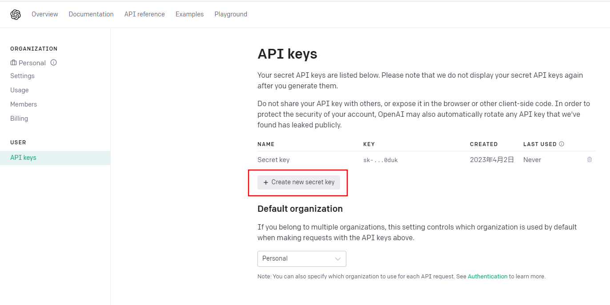

这个key的数量应该没有限制,但是不要随便暴露,因为这个使用是收费的

每个账号一开始会给一定的免费额度,之前是18刀,现在是5刀,这个额度是限时的,**过期无法使用**

我就是在使用的前一天过期了,然后因为充值比较困难,又买了一个成品号

**这边如果用我提供的网站买账号的话,最好买5美金免费额度的,因为我4月买的账号,6月免费额度就要过期了,18美金的估计都是快过期的**

他这个充值得绑美国那边的银行卡,我看了一下开一张虚拟银行卡得5刀,所以我直接放弃,买个号更便宜

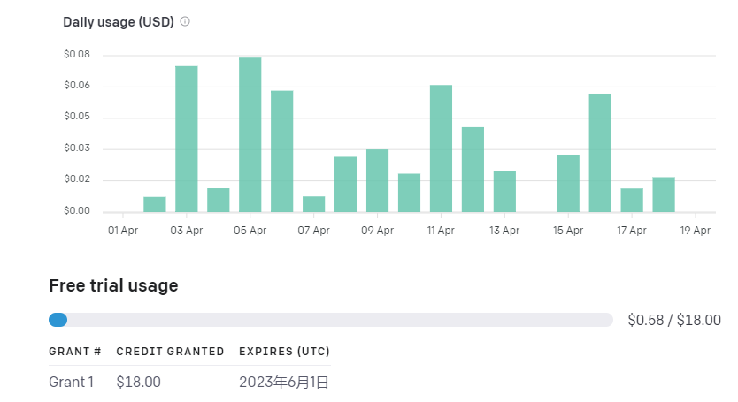

这还是挺耐用的,花费不是很大

有了api key之后,还需要一个使用软件,自己写代码发请求也是可以的,但是没必要

现在有不少开源软件可以直接使用,而且UI样式也不错

我这边提供几个我常用的

桌面端:[Bin-Huang/chatbox: Your Ultimate Copilot on the Desktop. Chatbox is a desktop app for GPT-4 / GPT-3.5 (OpenAI API) that supports Windows, Mac & Linux. (github.com)](https://github.com/Bin-Huang/chatbox)

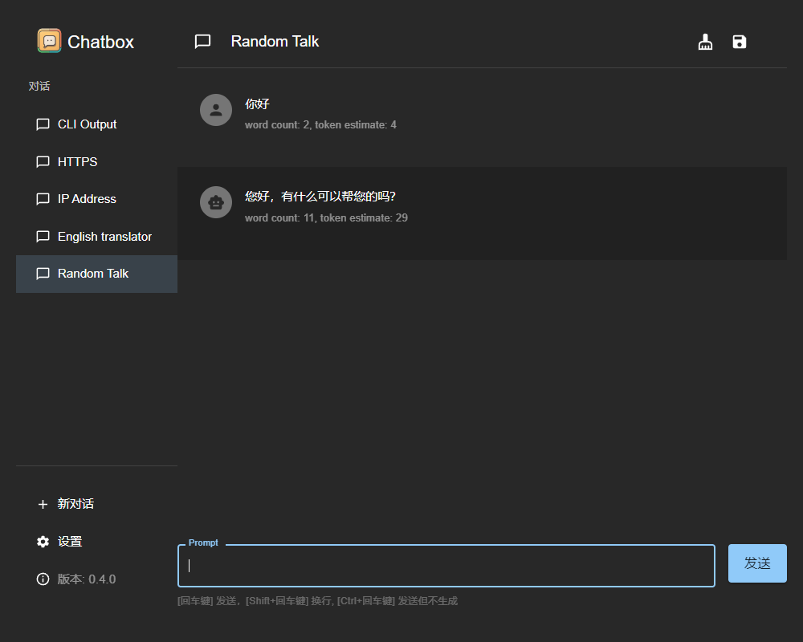

web端:[ChatGPT Next Web (chat-gpt-next-web.vercel.app)](https://chat-gpt-next-web.vercel.app/)

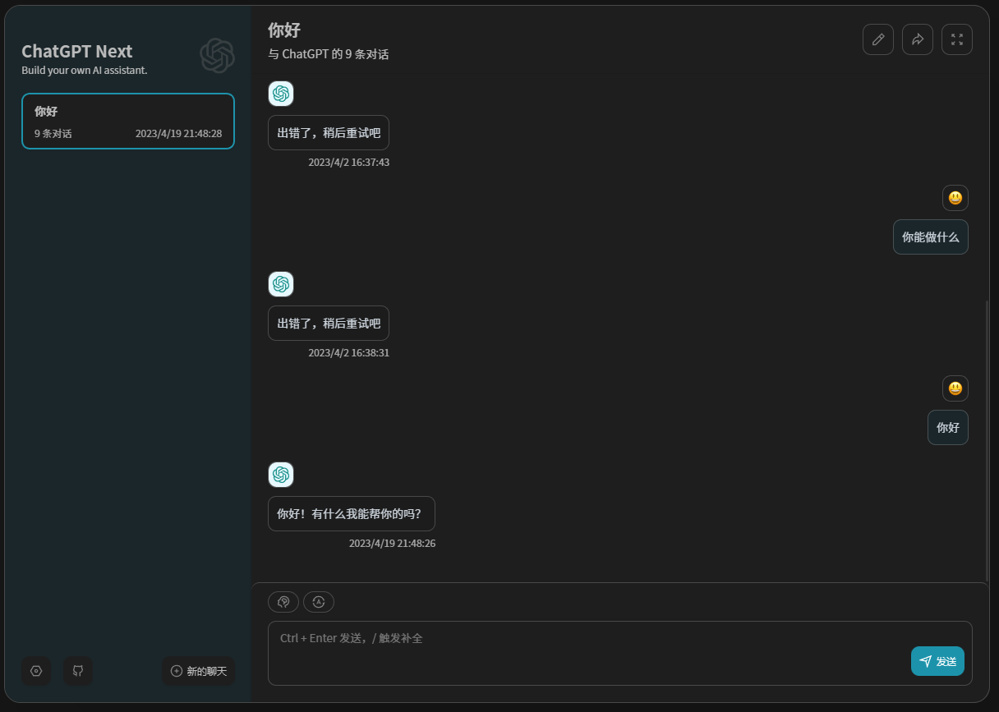

utools-插件(chatGPT.好友)

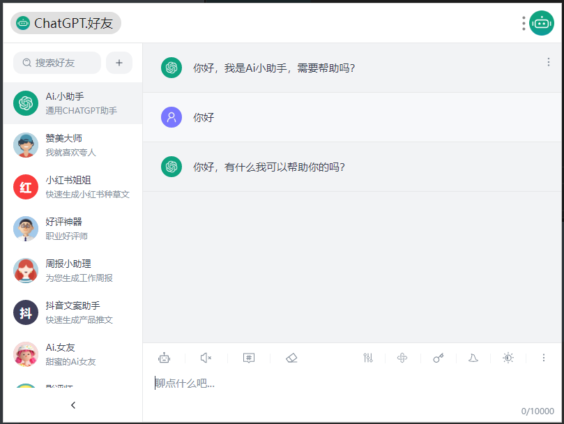

手机使用


这些都是使用api key就可以使用gpt的功能

**使用api key优点: 快,可以达到秒出答案**

## 应用技巧

这部分有两块内容,主要是我平时在工作和学习中发现的小技巧吧

**一是怎么让gpt的回答我想要的内容,二是使用gpt做哪些事更高效**

### 1.使用提示词(prompt)

这种方式就是让gpt角色扮演,能够从专业人员的角度回答问题

github上有一个仓库提供了很多提示词,可以参考使用

[PlexPt/awesome-chatgpt-prompts-zh: ChatGPT 中文调教指南。各种场景使用指南。学习怎么让它听你的话。 (github.com)](https://github.com/PlexPt/awesome-chatgpt-prompts-zh)


在新的会话中,先使用提示词,后续的回答都会被限制在这个范围内

### 2.地道的翻译

这个直接看对比


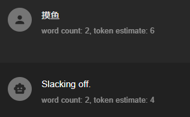

国内翻译软件,有道应该是比较强的,但是碰到'摸鱼'这种比较新的词汇,翻译出来就是直译'触摸鱼'

gpt能够理解词汇的本意,翻译成'懈怠'

### 3.代码优化

优化前

```js
function quickSort (arr) {
if(arr.length <= 1) {
return arr
}
let pivotIndex = Math.floor(arr.length / 2);
let pivot = arr.splice(pivotIndex, 1)[0];
let left = []
let right = []

for(let i = 0; i < arr.length; i++){
    if(arr[i] < pivot) {
        left.push(arr[i])
    }
    else{
        right.push(arr[i])
    }
}
return quickSort(left).concat([pivot],quickSort(right))
}
```

对话过程

输入代码 -> 请帮我优化这段代码

**优化后**

```js
function quickSort(arr, leftIndex = 0, rightIndex = arr.length - 1) {
  if (leftIndex < rightIndex) { // 控制递归结束的条件
    const pivotIndex = partition(arr, leftIndex, rightIndex);
    quickSort(arr, leftIndex, pivotIndex - 1);
    quickSort(arr, pivotIndex + 1, rightIndex);
  }
  return arr;
}

function partition(arr, leftIndex, rightIndex) {
  const pivotIndex = Math.floor(Math.random() * (rightIndex - leftIndex + 1) + leftIndex); // 随机选择枢纽元素
  const pivot = arr[pivotIndex];
  swap(arr, pivotIndex, rightIndex); // 将枢纽元素交换到数组最后

  let i = leftIndex - 1;
  for (let j = leftIndex; j <= rightIndex - 1; j++) {
    if (arr[j] < pivot) {
      i++;
      swap(arr, i, j);
    }
  }
  swap(arr, i + 1, rightIndex); // 将枢纽元素放回正确的位置
  return i + 1; // 返回枢纽元素最终的位置
}

function swap(arr, i, j) {
  [arr[i], arr[j]] = [arr[j], arr[i]];
}

const arr = [3, 2, 1, 5, 4];
console.log(quickSort(arr)); // [1, 2, 3, 4, 5]

```

这里是写了个快排,我之前的写法是需要创建新数组,空间复杂度会大一些,我把我写的代码发给gpt,并告诉它帮我优化这段代码

他在这个的基础上做了数组的原地置换,减少了空间复杂度

### 4.bug查找

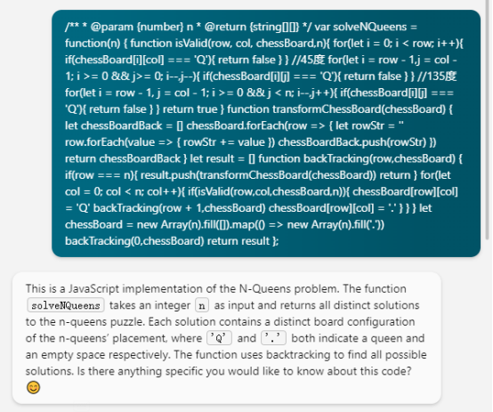

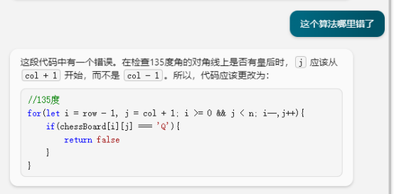

这个是我写N皇后算法题的时候,写错了符号

代码运行不报错,但是结果不对,直接发给new bing,一下子就给我找到错误的地方了

**在算法问题上这个功能非常好用**

之前写逻辑图优化,递归计算层数,怎么写都不对,然后debugger又困难,最后也是通过gpt找到了问题

### 5.代码解释

这个也适合用在算法中,或者说项目中不熟悉的某块代码

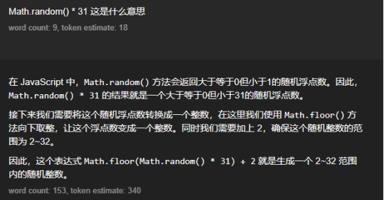

这个是我前面让它给我生成2-32的随机数

给出的代码中有这么一句,我可以直接追问,这句代码的作用,解释是非常详细的


### 6.格式转换

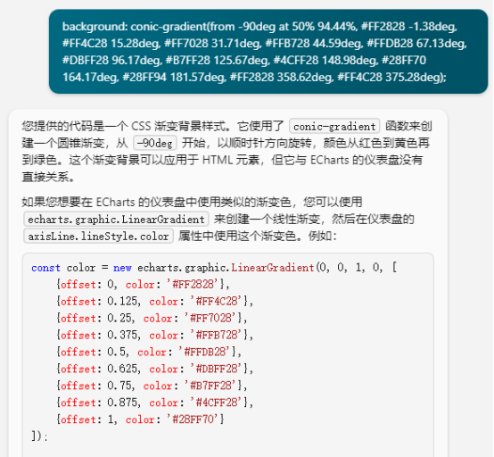

这里是我写头部卡片的时候,设计稿提供了一个渐变色,我直接从figma上copy的是css的样式

这里只有一部分截图,我在前面是提供了,echarts渐变色的格式的

所以当我给出渐变色的时候,gpt能帮我自动转换

## 相关工具推荐

### new Bing

微软的new Bing是使用gpt4的,相比于直接使用gpt有些不同

1. new Bing是联网的,chatGpt是不联网的,所以通过new Bing可以获取一些最新的信息

​	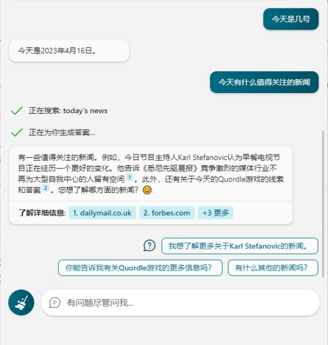

2. new Bing的回答是依据搜索引擎的相关数据,我们可以查看回答的来源

#### new Bing使用方式

很无奈的是,在Edge浏览器中new Bing无法直接使用,尽管用了梯子,还是会跳转到中国区,中国区是没有chat功能的

这里也是通过一个开源软件解决了这个问题

[dice2o/BingGPT: Desktop application of new Bing's AI-powered chat (Windows, macOS and Linux) (github.com)](https://github.com/dice2o/BingGPT)

这个实际上就是一个new Bing的桌面版,但是帮我们解决了无法访问的问题

### GitHub Copilot

这个我这边是VScode插件,应该IDEA也会支持

这个是昊元哥推荐给我使用的,通过学生认证之后可以免费使用

我主要使用了几个能力

- 代码补全,通过前面写过的代码或者注释,做自动补充
- 自动注释,代码写完之后写`//`可以补充注释
- 写测试用例

## 使用建议

目前体验下来,通过api key的方式使用是最快速的

而且可以通过直接购买成品号的方式直接使用赠送的额度,用完了直接换一个账号

这个成本是比较低的

鉴于公司提供的vpn节点是日本的,而且只能浏览器使用

所以可以使用我推荐的web版工具

公司的合小ai提供了gpt4的能力,但是可能用的人多了,目前给关闭了

可以关注一下这个
