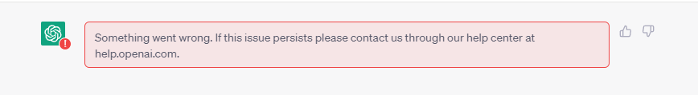
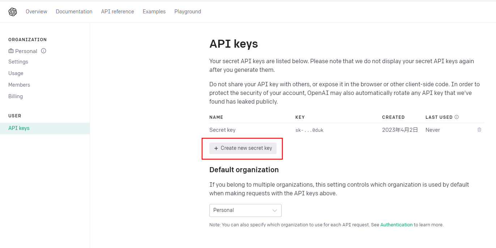
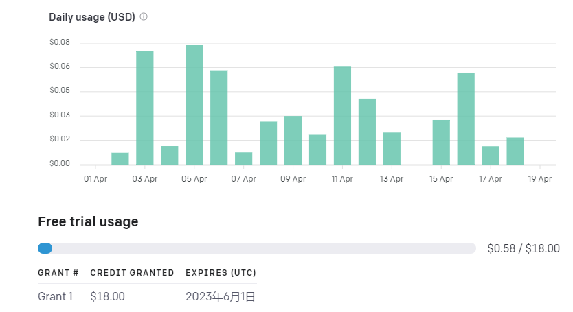
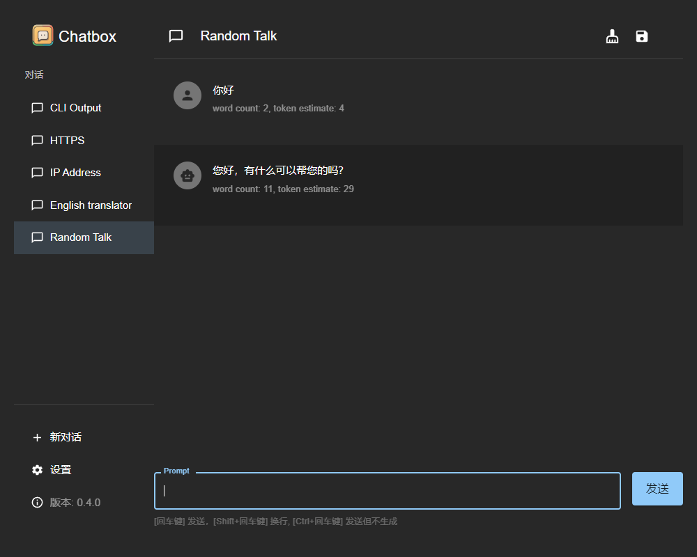
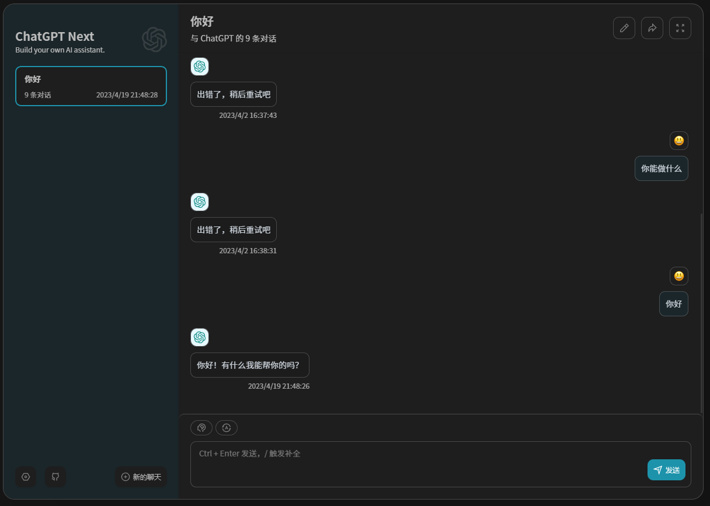
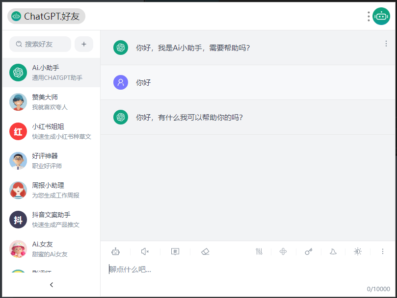

## 前言

本次分享主要是关于chatgpt在学习和工作中的一些使用技巧,主要是基于gpt-3.5的一些使用经验

整体分为几个部分

- 账号获取
- 使用方式
- 应用技巧
- 相关工具推荐

## 账号获取

### 自己申请

我申请账号比较早,当时申请是只需要一个邮箱和一个境外手机号

邮箱要求不高,我用qq邮箱都可以申请

主要是境外手机账号这一块

可以通过一个在线网站获取境外的虚拟手机号\

[获取虚拟手机号码。短期手机号码。手机短信激活服务 (sms-activate.org)](https://sms-activate.org/cn/getNumber#)

这个成本也低,只要几块钱

这方面就不细说了,网上有很多相关教程

### 购买成品号

还有个更简单的方式,直接购买成品号

这里也提供购买方式,现在都很便宜,只要几块钱

https://www.77zhanghao.com/baidu/2023-02-13/2994.html

## 使用方式

因为现在openAI对中国的封禁力度有点大,所以有了账号之后使用上也是困难重重

接下来我会推荐几个目前还能用的比较好的使用方式

### 直接访问官网

官网登录是需要梯子(vpn)通过欧美节点才可以登录的,东亚这边所有国家的节点都登录不了.他这里是有ip限制的

我们公司提供的代理服务器应该是日本的,同样是无法登录的

通过欧美节点成功登录之后,是可以使用了,但是因为节点距离我们比较远的问题,还有使用人数的问题,

经常是问一个问题就会网络错误,只能重新刷新页面



这时候有个小技巧,登录之后可以切换节点到离得近网速快的节点

因为他只是登录时做了ip限制,在使用时没有这个限制了

### 使用api key访问

这也是官网提供的方式

现在很多所谓的AI其实只是调用了gpt 的接口

每个账号都是可以提供api key的,通过这个解决前面提到的网络错误问题

就像我前面说的,他只是网站登录时做了限制,通过这种方式直接避免了使用网站

#### api key的获取

https://platform.openai.com/account/api-keys

通过这个网址登录之后可以查看自己的key



这个key的数量应该没有限制,但是不要随便暴露,因为这个使用是收费的

每个账号一开始会给一定的免费额度,之前是18刀,现在是5刀,这个额度是限时的,过期无法使用

我就是在使用的前一天过期了,然后因为充值比较困难,又买了一个成品号

他这个充值得绑美国那边的银行卡,我看了一下开一张虚拟银行卡得5刀,所以我直接放弃,买个号更便宜



这还是挺耐用的,花费不是很大

有了api key之后,还需要一个使用软件,自己写代码发请求也是可以的,但是没必要

现在有不少开源软件可以直接使用,而且UI样式也不错

我这边提供几个我常用的

桌面端:[Bin-Huang/chatbox: Your Ultimate Copilot on the Desktop. Chatbox is a desktop app for GPT-4 / GPT-3.5 (OpenAI API) that supports Windows, Mac & Linux. (github.com)](https://github.com/Bin-Huang/chatbox)



web端:[ChatGPT Next Web (chat-gpt-next-web.vercel.app)](https://chat-gpt-next-web.vercel.app/)



utools-插件(chatGPT.好友)



这些都是使用api key就可以是gpt的功能


### 代码优化

优化前

```js
function quickSort (arr) {
if(arr.length <= 1) {
return arr
}
let pivotIndex = Math.floor(arr.length / 2);
let pivot = arr.splice(pivotIndex, 1)[0];
let left = []
let right = []

for(let i = 0; i < arr.length; i++){
    if(arr[i] < pivot) {
        left.push(arr[i])
    }
    else{
        right.push(arr[i])
    }
}
return quickSort(left).concat([pivot],quickSort(right))
}
```

对话过程

输入代码 -> 请帮我优化这段代码

**优化后**

```js
function quickSort(arr, leftIndex = 0, rightIndex = arr.length - 1) {
  if (leftIndex < rightIndex) { // 控制递归结束的条件
    const pivotIndex = partition(arr, leftIndex, rightIndex);
    quickSort(arr, leftIndex, pivotIndex - 1);
    quickSort(arr, pivotIndex + 1, rightIndex);
  }
  return arr;
}

function partition(arr, leftIndex, rightIndex) {
  const pivotIndex = Math.floor(Math.random() * (rightIndex - leftIndex + 1) + leftIndex); // 随机选择枢纽元素
  const pivot = arr[pivotIndex];
  swap(arr, pivotIndex, rightIndex); // 将枢纽元素交换到数组最后

  let i = leftIndex - 1;
  for (let j = leftIndex; j <= rightIndex - 1; j++) {
    if (arr[j] < pivot) {
      i++;
      swap(arr, i, j);
    }
  }
  swap(arr, i + 1, rightIndex); // 将枢纽元素放回正确的位置
  return i + 1; // 返回枢纽元素最终的位置
}

function swap(arr, i, j) {
  [arr[i], arr[j]] = [arr[j], arr[i]];
}

const arr = [3, 2, 1, 5, 4];
console.log(quickSort(arr)); // [1, 2, 3, 4, 5]

```

