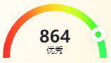
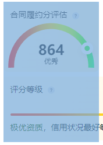

### 效果图



### 整体思路

这个效果算是给我打开新世界的大门了

**echarts,图表是可以层叠的**

很多复杂效果是通过echarts层叠实现的,比如上面这个效果

这个图是通过仪表盘(gauge)效果实现颜色渐变效果,再通过饼图(pie)实现圆点的位置移动

### 渐变圆弧实现

```js
const color = new echarts.graphic.LinearGradient(0, 0, 1, 0, [
  { offset: 0, color: '#FF2828' },
  { offset: 0.125, color: '#FF4C28' },
  { offset: 0.25, color: '#FF7028' },
  { offset: 0.375, color: '#FFB728' },
  { offset: 0.5, color: '#FFDB28' },
  { offset: 0.625, color: '#DBFF28' },
  { offset: 0.75, color: '#B7FF28' },
  { offset: 0.875, color: '#4CFF28' },
  { offset: 1, color: '#28FF70' }
])
```

这是渐变颜色,直接从设计图中获取的是

```css
background: conic-gradient(from -90deg at 50% 94.44%, #FF2828 -1.38deg, #FF4C28 15.28deg, #FF7028 31.71deg, #FFB728 44.59deg, #FFDB28 67.13deg, #DBFF28 96.17deg, #B7FF28 125.67deg, #4CFF28 148.98deg, #28FF70 164.17deg, #28FF94 181.57deg, #FF2828 358.62deg, #FF4C28 375.28deg);

```

这里我是通过gpt实现转换的,很方便

```js
series: [
      {
        type: 'gauge',
        startAngle: 182, 
        endAngle: -2,
        center: centerArr,
        radius: '90%',
        min: options.min || 0,
        max: options.max || 100,
        splitNumber: 8,
        axisLine: {
          lineStyle: {
            width: 10, //通过这里控制圆环宽度
            color: [[1, color]] //颜色
          }
        },
        pointer: {
          show: false
        },
        axisTick: {
          show: false
        },
        splitLine: {
          show: false
        },
        axisLabel: {
          show: false
        },
        title: {
          offsetCenter: [0, '-10%'],
          fontSize: options?.titleSize || 12,
          color: '#1A1C24'
        },
        detail: {
          show: options.detailShow === false ? false : true,
          fontSize: 24,
          offsetCenter: [0, '-35%'],
          color: '#1A1C24'
        },

        data: options.data || []
      },
    ]
```

### 小圆点实现

这里是使用饼图数据堆叠,只是样式变了的这种图形

[Examples - Apache ECharts](https://echarts.apache.org/examples/zh/editor.html?c=pie-half-donut)

整个图形分为四部分,第一部分就是传入数据

第二部分用来显示圆点

第三部分是画圆点之后的剩余部分

第四部分是隐藏的半圆部分,

整个图形实际上看上去的两倍大



```js
{
        type: 'pie',
        color: ['transparent', 'transparent', 'transparent'],//饼图透明,颜色由仪表盘实现
        animationEasingUpdate: 'cubicOut',
        startAngle: 182,
        endAngle: -2,
        center: centerArr,
        radius: ['80%', '81%'],
        silent: true, //不响应鼠标事件
        labelLine: {
          show: false
        },
        data: [
          {
            name: '',
            value: options.data[0].value || options.min || 200,
            itemStyle: {
              show: true,
              color: 'transparent'
            }
          },
          {
            //画中间的圆
            name: '',
            value: 0,
            label: {
              rotate: 90,
              position: 'inside',
              width: 5,//给宽高和padding是为了让中间透明看到仪表盘的颜色
              height: 5,
              padding: 5,
              borderColor: '#fff',

              verticalAlign: 'bottom',
              backgroundColor: 'transparent',
              borderRadius: 30,
              borderWidth: 3, //边框实现白色圆环
              shadowColor: 'rgba(26, 28, 36, 0.1)',
              shadowBlur: 10,
              shadowOffsetY: 4
            }
          },
          {
            //画半圆剩余的圆环
            name: '',
            value: options.max - options.data[0].value || 0,
            itemStyle: {
              color: 'transparent'
            }
          },
          {
            //画下面部分隐藏的半圆圆环
            name: '',
            value: options.max || 100
          }
        ]
      }
```

### 整体代码

```js
let centerArr = ['50%', '46%']
const color = new echarts.graphic.LinearGradient(0, 0, 1, 0, [
  { offset: 0, color: '#FF2828' },
  { offset: 0.125, color: '#FF4C28' },
  { offset: 0.25, color: '#FF7028' },
  { offset: 0.375, color: '#FFB728' },
  { offset: 0.5, color: '#FFDB28' },
  { offset: 0.625, color: '#DBFF28' },
  { offset: 0.75, color: '#B7FF28' },
  { offset: 0.875, color: '#4CFF28' },
  { offset: 1, color: '#28FF70' }
])
export const guageOptions = options => {
  return {
    series: [
      {
        type: 'gauge',
        startAngle: 182, 
        endAngle: -2,
        center: centerArr,
        radius: '90%',
        min: options.min || 0,
        max: options.max || 100,
        splitNumber: 8,
        axisLine: {
          lineStyle: {
            width: 10,
            color: [[1, color]]
          }
        },
        pointer: {
          show: false
        },
        axisTick: {
          show: false
        },
        splitLine: {
          show: false
        },
        axisLabel: {
          show: false
        },
        title: {
          offsetCenter: [0, '-10%'],
          fontSize: options?.titleSize || 12,
          color: '#1A1C24'
        },
        detail: {
          show: options.detailShow === false ? false : true,
          fontSize: 24,
          offsetCenter: [0, '-35%'],
          color: '#1A1C24'
        },

        data: options.data || []
      },

      {
        type: 'pie',
        color: ['transparent', 'transparent', 'transparent'],
        animationEasingUpdate: 'cubicOut',
        startAngle: 182,
        endAngle: -2,
        center: centerArr,
        radius: ['80%', '81%'],
        silent: true, //不响应鼠标事件
        labelLine: {
          show: false
        },
        data: [
          {
            name: '',
            value: options.data[0].value || options.min || 200,
            itemStyle: {
              show: true,
              color: 'transparent'
            }
          },
          {
            //画中间的圆
            name: '',
            value: 0,
            label: {
              rotate: 90,
              position: 'inside',
              width: 5,
              height: 5,
              padding: 5,
              borderColor: '#fff',

              verticalAlign: 'bottom',
              backgroundColor: 'transparent',
              borderRadius: 30,
              borderWidth: 3,
              shadowColor: 'rgba(26, 28, 36, 0.1)',
              shadowBlur: 10,
              shadowOffsetY: 4
            }
          },
          {
            //画半圆剩余的圆环
            name: '',
            value: options.max - options.data[0].value || 0,
            itemStyle: {
              color: 'transparent'
            }
          },
          {
  			//画下面部分隐藏的半圆圆环
            name: '',
            value: options.max || 100
          }
        ]
      }
    ]
  }
}
```


