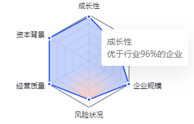

### 效果图



### 概况

这个图表的特殊之处在于,这个渐变色从端点开始渐变

第二个,图表实现tooltip显示单个拐点的数据

第三个,低版本echarts(5.01)实现如图拐点样式

### 端点渐变实现

这个其实就是径向渐变

```js
areaStyle: {
      color: new echarts.graphic.RadialGradient(0.5, 1, 0.4, [ // 径向渐变
        {
          color: 'rgba(34, 88, 244, 0.2)',
          offset: 1
        },
        {
          color: 'rgba(253, 82, 25, 0.2)',
          offset: 0
        }
      ])
    },
```

前面三个参数分别是:

- 渐变的起始圆心 X 坐标。
- 渐变的起始圆心 Y 坐标。
- 渐变的半径。

把圆点调整到端点,然后设置渐变色就可以了

### tooltip显示单个拐点的数据

这个实现方式确实离谱

雷达图的tooltip获取不到拐点的index

所以这里是通过遍历给每个拐点单独一层,

设置样式不可见,只显示tooltip,

```js
let len = data.length
  let res = [series]
  for (let i = 0; i < len; i++) { //这里循环添加是为了tooltip显示单个拐点内容
    let arr = new Array(len).fill(null)
    arr[i] = data[i]
    res.push({
      name: '评分指标',
      type: 'radar',
      color: '#2258F4',
      symbol: 'none', //不显示拐点,拐点样式下面实现
      data: [
        {
          value: arr
        }
      ],
      lineStyle:{
        color:'transparent' //样式由第一层负责展示,遍历生成的只为了tooltip
      },
      tooltip: {
        show: true,
        formatter: () => { //设置tooltip样式
          let label = indicator[i].name
          let value = data[i]
          return `<div style="font-weight: 500;">${label}</div><div>优于行业${value}%的企业`
        },
        shadowOffsetY:12,
        shadowBlur:32,
        shadowColor:'rgba(26, 28, 36, 0.1)',
        borderWidth:0
      },
      z: 2 //注意层级
    })
  }
```

### 拐点样式实现

主要是在data中,用同样的数据,设置两层

这个会按顺序层叠

第一层设置拐点大一些,设置白色

第二次设置小一些,覆盖在上面,实现如图效果

```js
	silent: true,
    data: [ // 这里两层是为了层叠实现拐点边框为白色的效果
      {
        value: data,
        symbolSize: 4, //拐点大小
        itemStyle:{
          color: '#fff',
          borderColor: 'transparent',
        },
      },
      {
        value: data,
        symbolSize: 2,
        itemStyle:{
          color: '#2258F4',
          borderColor: '#2258F4',
        },
      },
      
    ],
```

### 整体代码

```js
export const radarOptions = options => {
  return {
    tooltip: {
      show: true
    },
    radar: {
      indicator: options.indicator,
      axisNameGap: 8,
      axisName: {
        color: '#1A1C24',
        fontWeight: 500
      },
      splitArea: {
        show: false
      },
      splitLine: {
        lineStyle: {
          color: ['#4E525E', '#E6E7EB', '#E6E7EB', '#E6E7EB', '#E6E7EB']
        }
      },
      axisLine: {
        lineStyle: {
          color: '#E6E7EB'
        }
      }
    },
    series: setSeries(options)
  }
}

function setSeries(options) {
  const { data, indicator } = options

  let series = {
    name: '评分指标',
    type: 'radar',
    color: '#2258F4',
    silent: true,
    data: [ // 这里两层是为了层叠实现拐点边框为白色的效果
      {
        value: data,
        symbolSize: 4,
        itemStyle:{
          color: '#fff',
          borderColor: 'transparent',
        },
      },
      {
        value: data,
        symbolSize: 2,
        itemStyle:{
          color: '#2258F4',
          borderColor: '#2258F4',
        },
      },
      
    ],
    tooltip: {
      show: false,
    },
    areaStyle: {
      color: new echarts.graphic.RadialGradient(0.5, 1, 0.4, [ // 径向渐变
        {
          color: 'rgba(34, 88, 244, 0.2)',
          offset: 1
        },
        {
          color: 'rgba(253, 82, 25, 0.2)',
          offset: 0
        }
      ])
    },
    z:3
  }
  let len = data.length
  let res = [series]
  for (let i = 0; i < len; i++) { //这里循环添加是为了tooltip显示单个拐点内容
    let arr = new Array(len).fill(null)
    arr[i] = data[i]
    res.push({
      name: '评分指标',
      type: 'radar',
      color: '#2258F4',
      symbol: 'none',
      data: [
        {
          value: arr
        }
      ],
      lineStyle:{
        color:'transparent'
      },
      tooltip: {
        show: true,
        formatter: () => {
          let label = indicator[i].name
          let value = data[i]
          return `<div style="font-weight: 500;">${label}</div><div>优于行业${value}%的企业`
        },
        shadowOffsetY:12,
        shadowBlur:32,
        shadowColor:'rgba(26, 28, 36, 0.1)',
        borderWidth:0
      },
      z: 2
    })
  }
  return res
}

```


