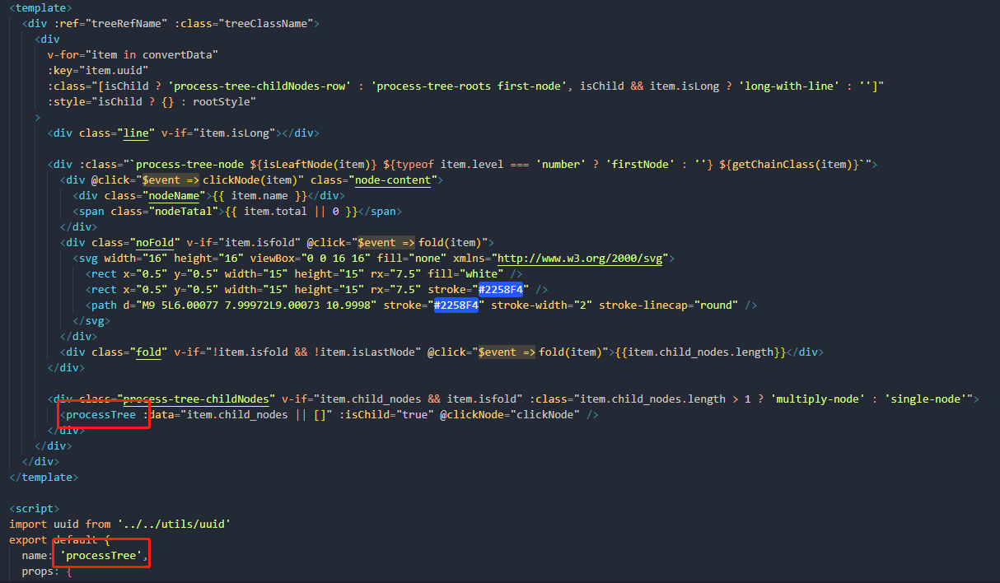
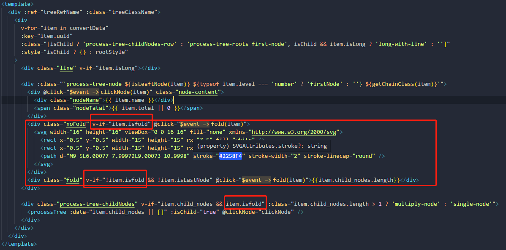
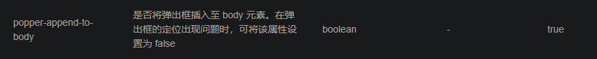

### 整体结构

产业链逻辑图分为上中下游三部分,后端响应数据是一个数组中三个对象,每个对象是一个树状结构,结构一样

因此这里通过v-ofr循环渲染三部分的内容

```vue
 <div class="row">
      <div class="tree-box" v-for="(node, idx) in treeData" :key="idx" ref="treeBox">
        <div class="title">{{ node.name }}<label>{{ node.total }}</label></div>
        <div class="inner">
          <PTrinkTree :treeData="node.child_nodes" @clickNode="clickNode($event, node.name)" />
        </div>
      </div>
    </div>
```


### 树状结构实现

树状图的基本结构是前辈写的,我是在前人的基础上做优化,这也是我第一次接触到**递归的方式使用组件**

组件只负责渲染一层节点,通过递归的方式去渲染其子节点

通过数据中的一些**属性或者props**传值的方式,区分不同的节点(根节点,子节点,叶子节点等)**添加不同的类名**实现样式上的修改




### 每一层的展开与收起功能实现

通过递归的方式给每一层节点添加`isfold`属性,用来控制节点的展开与收起(这里true为展开,和fold表意相反了)

初始化时,默认全部展开设置成`true`

```js
    //递归设置折叠
    setFold(arr,fold) {
      arr.forEach(item => {
        if(item.child_nodes && item.child_nodes.length > 0){
          this.$set(item,'isfold',fold)
          this.setFold(item.child_nodes,fold)
        }
      })
    },
```



当节点的`isfold`为false时,不渲染其子节点,实现收起效果

大红框中是切换按钮的实现代码,通过点击事件去实现`isfold`值的切换


### 按上中下游每部分所占的层级数设置每部分的占页面的宽度比例

这里原本文档中是根据固定宽度去计算每部分的宽度,但是从页面适配上考虑这样做肯定是不行

这种并排结构而且按比例划分,那就该想到**flex**

这里的实现原理就是按当前的层级数去动态设置元素的`flex`

首先获取当前每部分的层级数(这里是展开的层级数,不是总层级数)

```js
setMaxLevel(data){ // 设置当前显示的最大层级
      data.map(item => {
        let treeData = item.child_nodes || []
        item.AllLevel = this.getLevel(treeData) // 递归获取最大层级
        return item
      })
      return data
    },
getLevel(arr,level = 0){ // 获取上中下游层级数
      level++
      let maxLevel = level
      arr.map(item => {
        if(item.child_nodes && item.child_nodes.length > 0 && item.isfold){ // 有子节点且展开 isfold === true是展开,这里表意反了
          const childMaxLevel = this.getLevel(item.child_nodes, level); // 递归调用 getLevel 函数
          maxLevel = Math.max(maxLevel, childMaxLevel); // 取子节点中最大的层级值
        }
        return item 
      })
      return maxLevel
    },
```

然后去动态修改每部分的`flex`值,这样就能实现每部分的比例按层级数展示,而且可以适配页面

```js
setFlex(){ // 设置flex
      this.setMaxLevel(this.treeData)
      let treeArr = this.$refs.treeBox
      if(treeArr && treeArr.length) {
        this.treeData.forEach(((item,index) => {
          treeArr[index].style.flex = item.AllLevel
        }))
      }
    },
```

在展开与收起的点击事件中调用这个方法,可以实现每次点击之后,宽度比例重新分配

```js
    fold(item) {
      item.isfold = !item.isfold
      this.setFlex()
    },
```

### 页面虚线效果实现

页面中横着的短虚线很方便实现,只需要通过伪元素(before,after)的边框线实现虚线效果,再通过定位修改位置

竖线是一样的原理,只是复杂一些


这里最大的问题是,虚线的长度是动态的,**不是固定的**

**其实这里有三根竖线**


第一次看到的时候,真感觉前辈挺强的,我是不太能想到这种写法

最长的这根虚线`height`可以设置100%,也就是组件的高度

```css
.multiply-node::before {
    content: '';
    display: block;
    position: absolute;
    width: 3px;
    height: 100%;
    border-left: 1px dashed #618AFF;
    left: -23px;
    top: 0;
}
```

然后通过给这一层的第一个节点和最后一个节点添加一个伪元素,设置白色背景色进行遮挡

```css
.multiply-node .process-tree-childNodes-row:first-child::after, .multiply-node .process-tree-childNodes-row:last-child::after {
    content: '';
    position: absolute;
    display: block;
    width: 5px;
    height: 50%;
    background: #fff;
    left: -24px;
}
```

设置高度50%,刚好遮挡多出来的一段虚线,通过定位控制遮挡的位置,就达成了如图效果

### 小屏下无法下载完整产业链图片的问题解决

原本的逻辑图大小不会超出屏幕,没有考虑到有滚动条的情况下,下载产业链图片出现不完整的情况

整个逻辑图组件的宽度设置是100%,占满页面除侧边栏之外的所有位置

当层级数太多放不下的时候,是通过滚动条去展示剩余内容,但是使用的下载方法只会下载指定元素显示的内容

所以这里需要去修改逻辑图整体的宽度,让整个逻辑图展示出来,至少是调用方法的那一刻得全部展示出来

```js
exportMap() {
      
      let target = this.$refs.industryChainView.$el
      setTimeout(() => {
          target.style.width = 'min-content' //方法调用之前width改成'min-content'展示全部内容
          toBlob(target, { style: { background: '#fff' } }).then(blob => {
            saveAs(blob, `${this.$parent.title}产业链图.png`)
            this.selectValue === '逻辑图' //&& document.body.removeChild(target)
            this.exportStatus = false
            target.style.width = '100%' //调用之后改回100%,这样才能使用滚动条
          })
      }, 0)
    },
```

直接使用`min-content`,内容虽然全部展示了,但是屏幕宽度有限,表面上是被截断的效果

设置100%时,可以通过滚动条滑动

### 全屏功能下,el-select选择器下拉框无法显示的问题修改

这个问题是因为使用了全屏api(fullScreen api),会把对应的DOM元素展示在最上层,这个最上层是真正的最上层,没有其他方法(至少我没找到)还能比他更高了

z-index,transform:translateZ,我都有试过

这里select会出问题的原因在于,下拉框对应的DOM元素放在body元素中,它不属于使用了fullScreen api的DOM元素,所以没办法显示

这个问题我当时搞了挺久的,但是解决方法却很简单



多看文档吧...

通过修改这个属性值就可以把下拉框放在select组件中,也就解决了上述问题

为啥要默认放body啊....