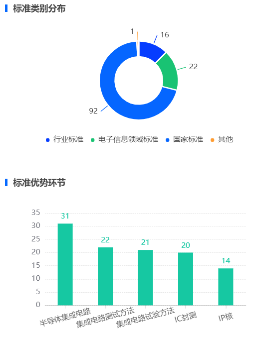

### dom

```HTML
<div ref="chart" class="chart"></div>
```

### 整体样式自己调

```css
.chart {
  width: 100%;
  height: 254px;
  position: relative;
  padding: 8px 0;
  margin-bottom: 10px;
  &::after {
    position: absolute;
    content: '';
    display: block;
    height: 12px;
    width: 4px;
    left: 0px;
    top: 13px;
    background-color: #0569FF;
  }
}
```

### js部分

```js
import * as echarts from 'echarts'
import ResizeListener from 'element-resize-detector'
import { merge } from 'lodash'
export default {
  name: 'use-echarts',
  props: {
    options: {
      type: Object,
      default: () => ({})
    }
  },
  data() {
    return {
      chart: null
    }
  },
  watch: {
    options: {
      deep: true,
      handler() {
        this.updateChartView()
      }
    }
  },
  mounted() {
    this.chart = echarts.init(this.$refs.chart)
    this.updateChartView()
    window.addEventListener('resize', this.handleWindowResize)
    this.addChartResizeListener()
  },

  beforeDestroy() {
    window.removeEventListener('resize', this.handleWindowResize)
  },
  methods: {
    /**
     * 将业务数据加入到基础样式配置中
     * @returns {Object} 完整的echart配置
     */
    assembleDataToOption() {
      const option = merge({}, this.options)
      return option
    },

    /**
     * 对chart元素尺寸进行监听，当发生变化时同步更新echart视图
     */
    addChartResizeListener() {
      const instance = ResizeListener({
        strategy: 'scroll',
        callOnAdd: true
      })
      instance.listenTo(this.$el, () => {
        if (!this.chart) { return }
        this.chart.resize()
      })
    },

    /**
     * 更新echart视图
     */
    updateChartView() {
      if (!this.chart) { return }

      const fullOption = this.assembleDataToOption()
      this.chart.setOption(fullOption, true)
    },

    /**
     * 当窗口缩放时，echart动态调整自身大小
     */
    handleWindowResize() {
      if (!this.chart) { return }
      this.chart.resize()
    }
  }
}

```

### option配置

#### 饼图

```js
export const pieOptions = (option) => {
  return {
    title: {
      text: option.title,
      x: 8, //标题位置调整
      textStyle: { //样式
        fontSize: 14,
        fontWeight: '600'
      }
    },
    tooltip: { //提示框
      trigger: 'item',
      backgroundColor: '#fff',
      borderWidth: 0,
      padding: 0,
      margin: 0,
      extraCssText: 'box-shadow: 0px 12px 32px rgba(26, 28, 36, 0.1);',
      formatter(params) { //自定义提示框样式
        const { name, value, color } = params //params有很多数据
        return `
        <div
        style="padding:12px 16px;background-color:#fff;border-radius:4px;width:138px;height:65px;box-sizing: border-box;">
        <div style="font-size: 12px;color: #696D7A; font-weight:600;">${name}</div>
        <div>
          <div style="display:flex;align-items:center; float:left">
            <div style="width:6px;height:6px;background-color:${color};margin-right:8px;border-radius:50%;"></div>
            <div style="font-size: 12px;color: #696D7A;margin-right:8px;font-weight:400;">${name}</div>
          </div>
          <div style="float:right;">
            <div style="font-size: 12px;color: #696D7A;font-weight:400;float:right">${value}</div>
          </div>
        </div>
              `
      }
    },
    legend: [ //图例
      {
        left: 'center',
        bottom: '8%',
        icon: 'circle', // 形状
        itemHeight: 8, // 大小
        itemWidth: 8, // 大小
        data: option.data
      }
    ],
    color: option.colors,
    series: [
      {
        name: option.title,
        type: 'pie',
        radius: ['30%', '50%'],
        itemStyle: {
          borderColor: '#fff',
          borderWidth: 2
        },
        label: {
          formatter: '{c}'
        },
        labelLine: {
          show: true,
          length2: 0
        },
        data: option.data
      }
    ]
  }
}
```

#### 柱状图

```js
export const barOptions = (option) => {
  return {
    title: {
      text: option.title,
      x: 8,
      textStyle: {
        fontSize: 14,
        fontWeight: '600'
      }
    },
    grid: { //整体图形的位置
      bottom: '18%',
      left: '15%'
    },
    tooltip: {
      show: true,
      borderWidth: 0,
      padding: 0,
      extraCssText: 'box-shadow: 0px 12px 32px rgba(26, 28, 36, 0.1);',
      formatter(params) {
        const { name, value, color } = params
        return `
        <div
        style="padding:12px 16px;background-color:#fff;border-radius:4px;width:138px;height:65px;box-sizing: border-box;">
        <div style="font-size: 12px;color: #696D7A; font-weight:600;">${name}</div>
        <div>
          <div style="display:flex;align-items:center; float:left">
            <div style="width:6px;height:6px;background-color:${color};margin-right:8px;border-radius:50%;"></div>
            <div style="font-size: 12px;color: #696D7A;margin-right:8px;font-weight:400;">${name}</div>
          </div>
          <div style="float:right;">
            <div style="font-size: 12px;color: #696D7A;font-weight:400;float:right">${value}</div>
          </div>
        </div>
            `
      }
    },
    // calculable: true,

    xAxis: [ //x轴调整
      {
        type: 'category',
        data: option.xData,
        boundaryGap: true,
        axisTick: {
          alignWithLabel: true
        },
        axisLine: { //轴线配置
          show: true,
          lineStyle: {
            onZero: false,
            type: 'solid',
            width: 1,
            color: 'rgba(0, 0, 0, .15)'
          }
        },
        axisLabel: {
          // x轴文字的配置
          show: true,
          interval: 0,
          rotate: option.rotate || 0,
          margin: option.margin || 8,
          align: 'center', //文字居中,倾斜的情况下不是默认居中的,要自己设置
          textStyle: {
            color: 'rgba(102, 102, 102, 1)',
            fontSize: 12
          }
        }
      }
    ],
    yAxis: [
      {
        type: 'value',
        axisLine: {
          show: false
        },
        splitLine: { //分隔线配置
          lineStyle: {
            type: 'dashed',
            width: 0.5,
            color: 'rgba(0, 0, 0, .15)'
          }
        },
        axisTick: {
          show: false
        }
      }
    ],

    series: [
      {
        // name: 'Budget 2011',
        type: 'bar',
        barWidth: 24,
        itemStyle: {
          color: option.color
        },
        label: {
          show: true, // 开启显示
          position: 'top', // 在上方显示
          color: option.color
        },
        data: option.yData
      }
    ]
  }
}
```

### 使用

```js
import { pieOptions, barOptions } from '~/hooks/charts-options'
import useCharts from '~/components/useCharts'
//组件引入别忘了
```

```vue
<useCharts :options="pieChart" /> //传入配置
```

```js
 data() {
    return {
      pieChart: {},
      pieChart1: {},
      pieData: {
        data: [],
        colors: ['#063DFF', '#19C373', '#0566FF', '#FF9D33'],
        title: '标准类别分布'
      },
      barChart: {},
      barChart1: {},
      barData: {
        title: '年度新增标准数量',
        xData: [],
        yData: [],
        color: '#0569FF'
      },
      barData1: {
        title: '标准优势环节',
        xData: [],
        yData: [],
        color: '#16C8A2',
        rotate: 15,
        margin: 20
      },
      barChart2: {
        title: {
          text: '标准缺失环节',
          x: 8,
          textStyle: {
            fontSize: 14,
            fontWeight: '600'
          }
        }
      }
    }
```

这里是根据不同的要求修改样式和数据

```js
this.pieChart = pieOptions(this.pieData)
```

传入对应的数据和样式要求,返回完整的option配置项

### 成品图




