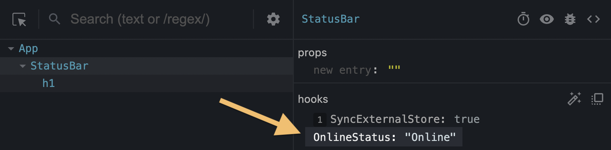

# useDebugValue

`useDebugValue` is a React Hook that lets you add a label to a custom Hook in [React DevTools.](https://react.dev/learn/react-developer-tools)

```jsx
useDebugValue(value, format?)
```

- Reference
  - [`useDebugValue(value, format?)`](https://react.dev/reference/react/useDebugValue#usedebugvalue)
- Usage
  - [Adding a label to a custom Hook](https://react.dev/reference/react/useDebugValue#adding-a-label-to-a-custom-hook)
  - [Deferring formatting of a debug value](https://react.dev/reference/react/useDebugValue#deferring-formatting-of-a-debug-value)(延迟格式化调试值)

---

## Reference 

### `useDebugValue(value, format?)` 

Call `useDebugValue` at the top level of your [custom Hook](https://react.dev/learn/reusing-logic-with-custom-hooks) to display a readable(可读的) debug value:

```jsx
import { useDebugValue } from 'react';

function useOnlineStatus() {
  // ...
  useDebugValue(isOnline ? 'Online' : 'Offline');
  // ...
}
```

[See more examples below.](https://react.dev/reference/react/useDebugValue#usage)

#### Parameters 

- `value`: The value you want to display in React DevTools. It can have any type.
- **optional** `format`: A formatting function. When the component is inspected, React DevTools will call the formatting function with the `value` as the argument, and then display the returned formatted value (which may have any type). If you don’t specify the formatting function, the original `value` itself will be displayed.

#### Returns 

`useDebugValue` does not return anything.

## Usage 

### Adding a label to a custom Hook 

Call `useDebugValue` at the top level of your [custom Hook](https://react.dev/learn/reusing-logic-with-custom-hooks) to display a readable debug value for [React DevTools.](https://react.dev/learn/react-developer-tools)

```jsx
import { useDebugValue } from 'react';

function useOnlineStatus() {
  // ...
  useDebugValue(isOnline ? 'Online' : 'Offline');
  // ...
}
```

This gives components calling `useOnlineStatus` a label like `OnlineStatus: "Online"` when you inspect them:



Without the `useDebugValue` call, only the underlying(底层的) data (in this example, `true`) would be displayed.

如果没有使用`useDebugValue`,只会显示底层对应的数据,

例如这里根据`isOnline`来显示`Online`或者`Offline`,那没使用`useDebugValue`就是显示true

>### Note
>
>Don’t add debug values to every custom Hook. 
>
>对于那些属于共享库并且具有复杂内部数据结构难以检查的自定义 Hooks 来说，这是最有价值的。

---

### Deferring formatting of a debug value 

You can also pass a formatting function as the second argument to `useDebugValue`:

```jsx
useDebugValue(date, date => date.toDateString());
```

Your formatting function will receive the debug value as a parameter and should return a formatted display value.

When your component is inspected(被审查), React DevTools will call this function and display its result.

This lets you avoid running potentially expensive formatting logic unless the component is actually inspected. (不检查不执行)

For example, if `date` is a Date value, this avoids calling `toDateString()` on it for every render.