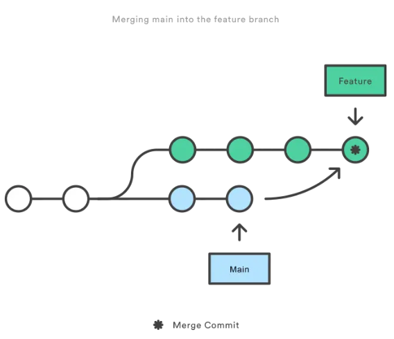
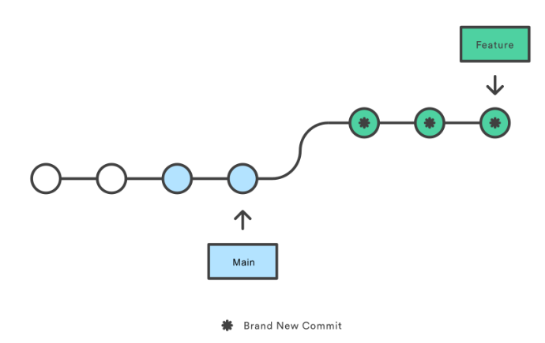

### merge

- Merge 操作会将两个不同的分支的历史记录合并成一个新的提交。它会创建一个新的合并提交，将两个分支的更改合并起来。
- 合并操作会保留原始分支的提交历史，因此可以清晰地看到每个分支的变化历史。

这里是git merge Feature main

把main分支合并到Feature分支

- 适用于合并公共分支、团队协作等情况。

### Rebase

同样的git rebase Feature main

这里会把我在feature分支上的最新修改放在main分支的最新修改之后

这样在我个人的开发分支上就是一条线性的分支

rebase适合将公共分支合并到个人分支

在个人分支合并到公共分支时,要用merge,不要用rebase