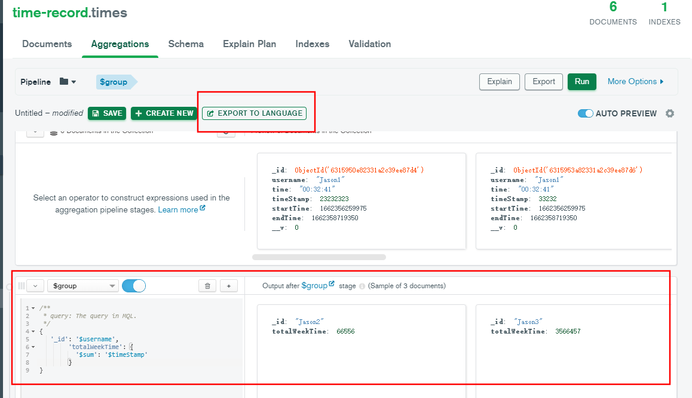

### 查询所有用户本周的学习时长

```js
 let usersArr = await Time.aggregate([
    {
      '$match': {
        'endTime': {
          '$gte': monday
        }
      }
    }, {
      '$group': {
        '_id': '$username',
        'totalWeekTime': {
          '$sum': '$timeStamp'
        }
      }
    }, {
      '$sort': {
        'totalWeekTime': -1
      }
    }
  ])
```

调用`aggregate` api 聚合查询,完成一些比较复杂的条件查询

`$match`相当于sql中的`where`

这里是查询所有数据中`endTime`的值大于等于`monday`的值的那些数据


然后再通过`$group`分组,相当于`order by`

这里根据某个字段分组是通过`_id:'$字段名'`的形式

`totalWeekTime`是新创建的字段,根据`_id`的分组,通过`$sum`将对应分组内`timeStamp`字段的值累加

`timeStamp`是每一次学习时长的毫秒数

到这里拿到了每个用户本周内的学习时长


`$sort`是排序,根据时长来进行排序,`1`是正序,逐渐增大,`-1`是倒序,由大到小


这样就拿到了本周内所有用户学习时长的倒序排列

学习视频:https://www.bilibili.com/video/BV1xV411z7FH?spm_id_from=333.1007.top_right_bar_window_history.content.click

### mongodb客户端妙用



下面框的部分可以响应式的做查询操作,确定功能

上面框的部分可以把下面写的查询语句转换成对应的代码,直接复制到项目中使用