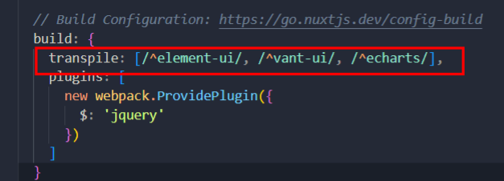

首先是npm安装对应的包

然后在plugins文件下新建一个js文件,用对应的包命名

这里就是全局配置的位置

nuxt中没有vue-cli中的main.js

举例:element-ui的引入

```js
import Vue from 'vue'
import Element from 'element-ui'

import '../static/style/element-variables.scss'

Vue.use(Element)

```

这其实和vue-cli中在main.js中引入的方式是一样的

接下来是nuxt配置

在nuxt.config.js中的plugins里添加对应的路径

```js
  plugins: [
    '@/plugins/element-ui',
    { src: '@/plugins/vant-ui', ssr: true },
    '@plugins/echarts'
  ],
```

然后在build中添加



照猫画虎,这里添加的是plugins中是文件名

