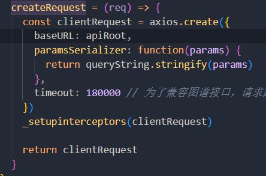

传递给后端的参数格式为` ?ids=1&ids=2&ids=3`这种**键名相同形式**的数据，需要用到paramsSerializer序列化

1. 先把传递的数据构造成数组格式，如下所示：

```
ids:[1,2,3]
```

2. 引入qs库

```js
import axios from 'axios';
import qs from 'qs'
```

3. 在axios请求加入如下代码

```js
paramsSerializer: function(params) {
  return qs.stringify(params, {arrayFormat: 'repeat'})
}
```

具体位置如图所示：



到这里请求给后台的数组数据，就自动转换为ids=1&ids=2&ids=3这种形式了。

paramsSerializer序列化，处理数组有如下几个形式

```js
qs.stringify({ids: [1, 2, 3]}, {indices: false})
 //形式：ids=1&ids=2&id=3
qs.stringify({ids: [1, 2, 3]}, {arrayFormat: 'indices'})
 //形式：ids[0]=1&ids[1]=2&ids[2]=3
qs.stringify({ids: [1, 2, 3]}, {arrayFormat: 'brackets'})
 //形式：ids[]=1&ids[]=2&ids[]=3
qs.stringify({ids: [1, 2, 3]}, {arrayFormat: 'repeat'}) 
//形式： ids=1&ids=2&id=3
```


由此可见，qs.stringify(params, {indices: false})和qs.stringify(params, {arrayFormat: ‘repeat’})都可达到预期的效果