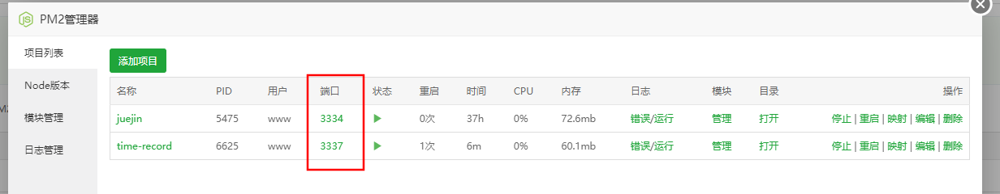
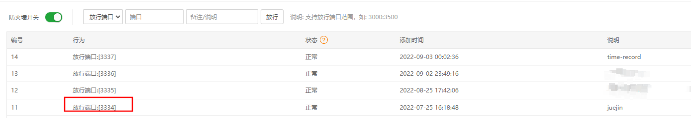

### 上传文件

可以直接在终端通过`yum install -y git`安装git

通过`git clone`从github下载项目文件

通过`npm i`安装依赖

### 文件修改

`.bin/www`文件里的`var port = normalizePort(process.env.PORT || '3334');`

将3334改成自己选定的项目端口

### pm2管理器

1. 添加项目
2. 启动文件为www文件
3. 目录是项目目录
4. 名称自己定
5. 其他的不动

将端口号改成自己在www文件中选定的端口

### 安全面板

放行选定端口

在浏览器测试,直接输入ip加端口号

显示hello koa2就成功了