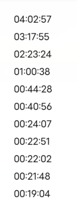

这里主要是字体原因



主要体现在0和1的差别很大,导致排列不整齐

**解决办法,使用等距字体**

这里我使用的是`Consolas, Monaco, monospace`

因为太久没使用过`font-family`,在这里卡了很久

```css
font-family: Consolas, Monaco, monospace;
```

**注意这里字体名称不需要用""括起来**

```css
font-family: "Consolas, Monaco, monospace";
```

**这种方式是错误的!!!**

需要引号的是字体名由两个单词组合起来的,例如:`"Gill Sans"`

```css
font-family: "Gill Sans", sans-serif;
```


