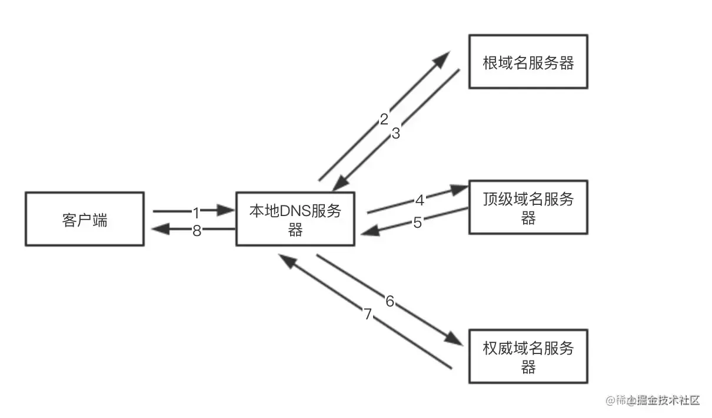

### 检测URL

看用户输入的是url还是搜索内容,如果是url就进行DNS域名解析

是搜索内容就要结合搜索引擎转换成url,再进行DNS域名解析

### DNS域名解析

DNS域名解析就是一个递归查找域名所对应的IP地址的过程

先是浏览器缓存中查找,

然后是本地的hosts文件查找

本地的DNS解析器缓存中查找

本地的DNS服务器中查找,

本地的DNS中没有,会向根域名服务器发起请求

根域名服务器返回对应的顶级域名服务器的地址

本地DNS服务器根据地址向顶级域名服务器发起请求

获取权威域名服务器的地址

再根据这个地址,最终得到想要的域名的IP地址

拿到IP之后,还有缓存操作

本地DNS服务器将得到的IP返回给操作系统,同时自己将IP地址缓存起来

操作系统将IP地址返回给浏览器,同时也将IP地址存放在hosts文件中

浏览器获得IP地址也会保存在浏览器缓存中

### 建立TCP连接

首先判断是不是https

进行三次握手,建立TCP连接

TCP三次握手之后,若是https这时要进行SSL握手

### 发送HTTP请求,服务器处理请求,返回响应结果

服务器接收到请求时,如果请求头有`if-none-match`和`if-modified-since`字段

服务器验证缓存是否有效,有效返回304,无效重新返回资源,状态码为200

### 关闭TCP连接

四次分手

### 浏览器渲染

1. 渲染进程将 HTML 内容转换为DOM 树结构。
2. 渲染引擎将 CSS 样式表转化为浏览器可以理解的styleSheets，计算出 DOM 节点的样式。
3. 创建布局树，并计算元素的布局信息。
4. 对布局树进行分层，并生成分层树。
5. 为每个图层生成绘制列表，并将其提交到合成线程。合成线程将图层分图块，并栅格化将图块转换成位图。
6. 合成线程发送绘制图块命令给浏览器进程。浏览器进程根据指令生成页面，并显示到显示器上。

