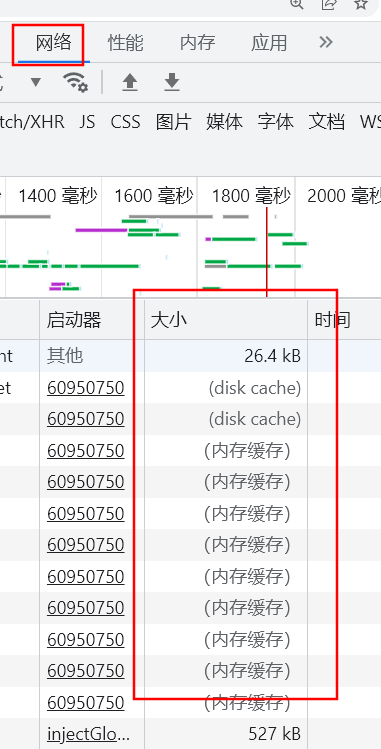

接口不使用缓存,只有静态资源,图片,css,js等使用缓存

缓存规则分为http1.0版本和http1.1版本

### http1.0版本

强缓存只使用expires

协商缓存使用last-modefied

**下面是http1.1版本**

### 缓存机制

浏览器发送请求前,根据请求头的`expires`和`cache-control`**客户端**判断是否命中强缓存

如果命中,**直接从缓存中获取资源,并且不会发起请求**

如果没有命中,浏览器发送请求,根据请求头中的`last-modified`和`etag`在**服务端**判断资源是否更改过

如果没有更改,返回304,命中协商缓存,使用缓存中的资源,返回200,则表示资源已经更改,需要发送请求从服务端获取最新资源

### 强缓存重点

简单总结强缓存:强缓存就是直接使用缓存的资源,不用去请求服务器资源

Expires:保存缓存的过期时间

Cache-Control:用于控制页面是否缓存资源

1. public:所有内容都将被缓存(客户端和代理服务器都可以缓存)
2. private: 所有内容只有客户端可以缓存
3. no-cache: **默认值**,客户端缓存内容,但是是否使用缓存要通过协商缓存来验证
4. no-store: 所有内容都不会被缓存,既不使用强缓存也不使用协商缓存
5. max-age=xxx,缓存内容在xxx秒之后失效

其中`Cache-Control`优先级比`Expires`高

强缓存需要服务端设置`expires`和`cache-control`。

#### 如何在浏览器中判断强制缓存是否生效

这里第二条应该有问题

> 一般非脚本会存在磁盘中

**浏览器读取缓存的顺序为memory –> disk。**

### 协商缓存重点

简单总结协商缓存: 在强缓存失效的情况下,向服务器发送请求来确定资源是否有更改,从而确定是否使用缓存资源

要和服务器进行沟通,这就是协商缓存名字由来

### 具体流程

1. 浏览器先发送一个请求,让服务端在响应头中返回请求资源上次更新的时间,就是`last-modified`,浏览器会缓存这个时间
2. 在浏览器下次请求时,request header中就会带上`if-modified-since`:[`last-modified`的值]
3. 服务器根据浏览器发送的修改时间和服务端的修改时间进行比对,时间相同表示资源未修改
4. 返回304,使用缓存中的资源

因为last-modified依赖的是保存的绝对时间,会有误差

- 单位为秒,1秒内的多次修改无法捕捉
- 不同机器读取的时间不一致,就有可能出现误差?**没懂**

使用etag解决上诉问题

`etag`是http协议中的一种web缓存验证机制,并且允许客户端进行协商缓存

生成etag常用的方法包括对资源内容使用抗碰撞散列函数，使用最近修改的时间戳的哈希值，甚至只是一个版本号。

#### 具体流程和`last-modified`类似

先发送请求获取etag的值,在下一次请求中的请求头中带上`if-none-match`:[`etag`的值]

在服务端对比etag的值,如果相同就是资源没有修改,返回304,使用缓存资源

#### 两者对比

精确度上:etag比last-modified强

优先级:etag > last-modified

性能上:last-modified比etag强

etag每次服务端生成都需要进行读写操作

但last-modified只需要进行读取操作

### 用户行为对浏览器缓存的影响

1. 打开网页，地址栏输入地址： 查找 `disk cache` 中是否有匹配。如有则使用；如没有则发送网络请求。
2. 普通刷新 (F5)：因为 TAB 并没有关闭，因此 `memory cache` 是可用的，会被优先使用(如果匹配的话)。其次才是 `disk cache`。
3. **强制刷新 (Ctrl + F5)**：浏览器不使用缓存，因此发送的请求头部均带有 `Cache-control:no-cache`(为了兼容，还带了 `Pragma:no-cache`),服务器直接返回 200 和最新内容。

