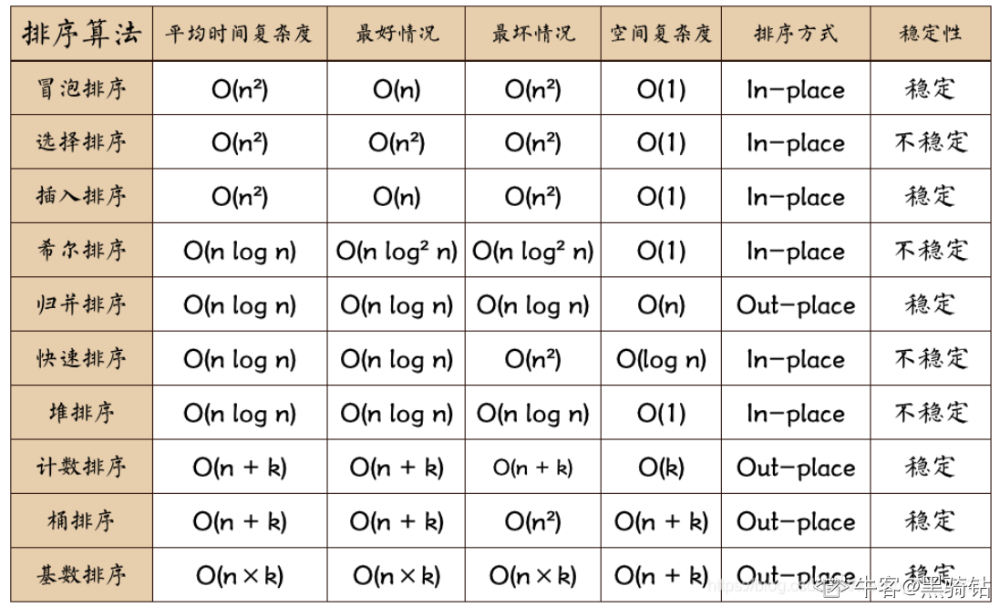

```
2.
[]的valueOf和toString的结果是什么？ //A
A
[] 的 valueOf 结果为 [] ，toString 的结果为 "" 
B
[] 的 valueOf 结果为 [] ，toString 的结果为 "[]"  
C
[] 的 valueOf 结果为 0 ，toString 的结果为 "[]"
D
[] 的 valueOf 结果为 "" ，toString 的结果为 ""
```

```
{}的valueOf()方法的值为{}

{}的toString()方法的值为[object object] 

[]的valueOf()方法的值为[]

[]的toString()方法的值为""(空串)
```


```
3.
排序算法中哪一种算法的时间复杂度是O(nlogn)？ //B
A
冒泡排序
B
快速排序
C
直接插入排序
D
直接选择排序
```



```
4.
通常情况下，一个URL的格式是 //C
A
协议//路径名称主机:端口/#哈希标识?搜索条件
B
协议//主机:端口/#哈希标识/路径名称?搜索条件 
C
协议//主机:端口/路径名称?搜索条件
D
协议//主机:端口?搜索条件/路径名称#哈希标识
```


协议：//主机：端口/路径名称?搜索条件#哈希标识


```
9.
关于javascript下列说法错误的是 //B
A
javasciprt中的变量、函数名、操作符都区分大小写
B
标识符的第一个字符必须是字母、下划线、数字或美元符号开头
C
javascript的语句末尾的分号可加可不加
D
javascript的基础数据类型有：Undefined、NaN、Boolean、Number、String、Symbol
```

估计题出错了,单选题,答案是b,

但是D中的NaN明显是错的

```
11.
Chrome浏览器都有哪些进程？
A
GPU 进程
B
渲染进程
C
插件进程
D
消息进程
```

没有消息进程

一个浏览器主进程,一个GPU进程,一个网络进程,多个渲染进程,多个插件进程

```
14.
假设线上代码的分支是master，本地修复bug的分支为fix，上线时下列哪些git操作是正确的 AD
A
git checkout master; git merge fix;git push origin master;
B
git checkout fix; git merge master;git checkout master;git push origin master;
C
git checkout master; git rebase fix;git push origin master;
D
git checkout fix; git rebase master;git checkout master;git merge fix;git push origin master;
```

这个不是很懂,有待学习

```
15.
在linux系统中，修改文件夹的权限使用的命令是
A
su
B
chown
C
chmod
D
usrchmod
```

```
1、Linux su（英文全拼：switch user）命令用于变更为其他使用者的身份 

  2、Linux chown（英文全拼：**change owner**）命令用于设置文件所有者和文件关联组的命令 

  3、Linux chmod（英文全拼：change mode）命令是控制用户对文件的权限的命令 

  4、无
```


75. 颜色分类

13. 罗马数字转整数

