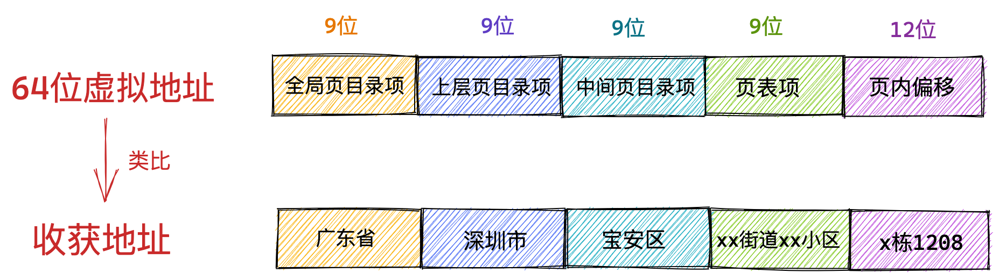
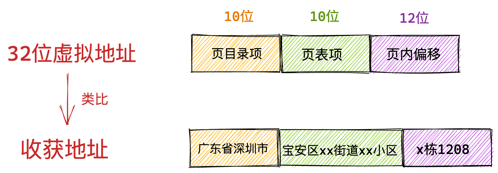
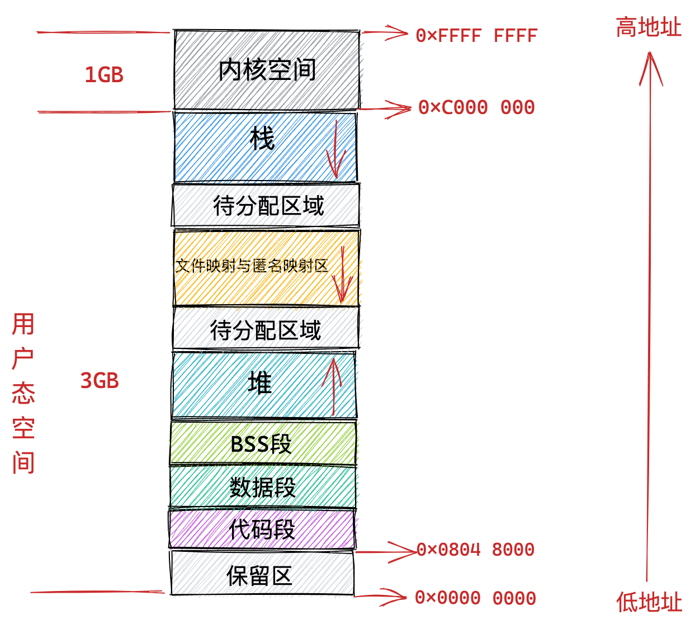
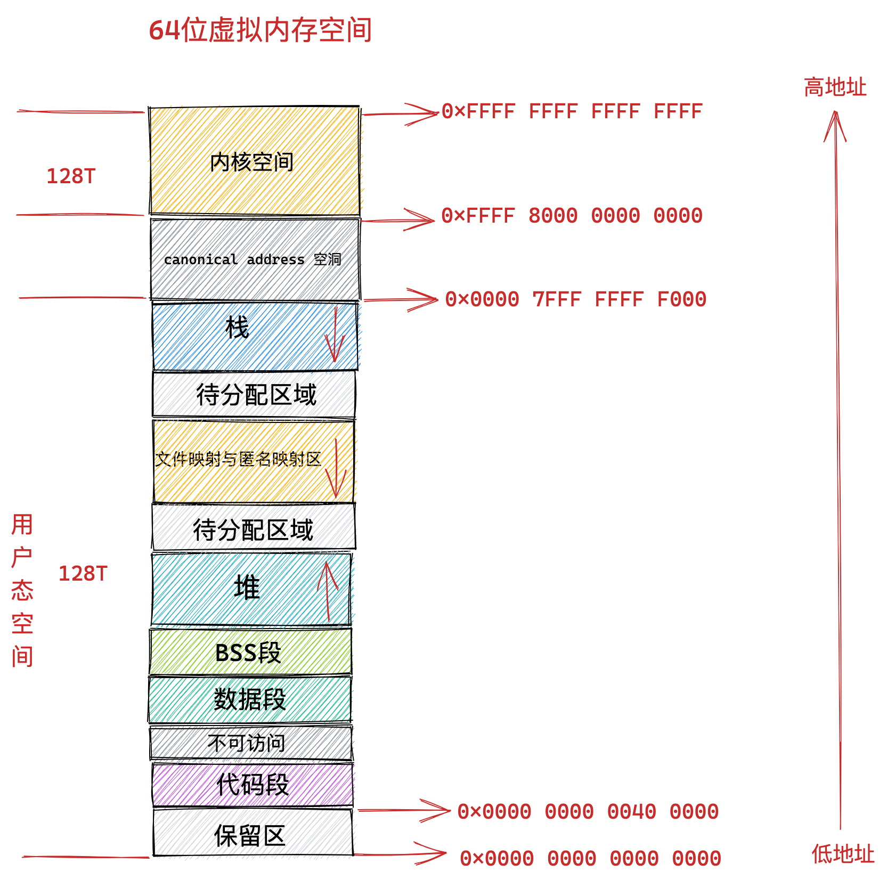

进程无论是在用户态还是在内核态能够看到的都是虚拟内存空间，物理内存空间被操作系统所屏蔽进程是看不到的。

进程通过虚拟内存地址访问这些数据结构的时候，虚拟内存地址会在内存管理子系统中被转换成物理内存地址，通过物理内存地址就可以访问到真正存储这些数据结构的物理内存了。

### 1. 到底什么是虚拟内存地址

虚拟地址可以人为的变来变去，但是物理地址永远是不变的。

 Intel Core i7 处理器为例，64 位虚拟地址的格式为：全局页目录项（9位）+ 上层页目录项（9位）+ 中间页目录项（9位）+ 页表项（9位）+ 页内偏移（12位）。共 48 位组成的虚拟内存地址。

32 位虚拟地址的格式为：页目录项（10位）+ 页表项（10位） + 页内偏移（12位）。共 32 位组成的虚拟内存地址。

###  2. 为什么要使用虚拟地址访问内存

程序局部性原理表现为：时间局部性和空间局部性。时间局部性是指如果程序中的某条指令一旦执行，则不久之后该指令可能再次被执行；如果某块数据被访问，则不久之后该数据可能再次被访问。空间局部性是指一旦程序访问了某个存储单元，则不久之后，其附近的存储单元也将被访问。

根据程序局部性原理，在某一段时间内，进程真正需要的物理内存其实是很少的一部分，我们只需要为每个进程分配很少的物理内存就可以保证进程的正常执行运转。

每个进程都拥有自己独立的虚拟地址空间，进程与进程之间的虚拟内存地址空间是相互隔离，互不干扰的。这样一来我们就可以将多进程之间协同的相关复杂细节统统交给内核中的内存管理模块来处理，极大地解放了程序员的心智负担。这一切都是因为虚拟内存能够提供内存地址空间的隔离，极大地扩展了可用空间。

任何一个虚拟内存里所存储的数据，本质上还是保存在真实的物理内存里的。只不过内核帮我们做了虚拟内存到物理内存的这一层映射，将不同进程的虚拟地址和不同内存的物理地址映射起来。

### 3. 进程虚拟内存空间

- 程序代码事先编写好，然后编译成二进制文件存放在磁盘中，CPU 会执行二进制文件中的机器码来驱动进程的运行.用于存放这些机器码的虚拟内存空间叫做**代码段**
- 那些在代码中被我们指定了初始值的全局变量和静态变量在虚拟内存空间中的存储区域我们叫做**数据段**。
- 那些没有指定初始值的全局变量和静态变量在虚拟内存空间中的存储区域我们叫做 **BSS 段**。这些未初始化的全局变量被加载进内存之后会被初始化为 0 值。
- 在虚拟内存空间中也需要一块区域来存放这些动态申请的内存，这块区域就叫做**堆**
- 动态链接库中的代码段，数据段，BSS 段，以及通过 `mmap` 系统调用映射的共享内存区，在虚拟内存空间的存储区域叫做**文件映射与匿名映射区**。
- 调用函数过程中使用到的局部变量和函数参数也需要一块内存区域来保存。这一块区域在虚拟内存空间中叫做**栈**。

- 用于存放进程程序二进制文件中的机器指令的代码段
- 用于存放程序二进制文件中定义的全局变量和静态变量的数据段和 BSS 段。
- 用于在程序运行过程中动态申请内存的堆。
- 用于存放动态链接库以及内存映射区域的文件映射与匿名映射区。
- 用于存放函数调用过程中的局部变量和函数参数的栈。

### 4. Linux 进程虚拟内存空间

在 32 位机器上，指针的寻址范围为 2^32，所能表达的虚拟内存空间为 4 GB。所以在 32 位机器上进程的虚拟内存地址范围为：0x0000 0000 - 0xFFFF FFFF。

因为在大多数操作系统中，数值比较小的地址通常被认为不是一个合法的地址，这块小地址是不允许访问的。

比如在 C 语言中我们通常会将一些无效的指针设置为 NULL，指向这块不允许访问的地址。

堆空间，从图中的红色箭头我们可以知道在堆空间中地址的增长方向是从**低地址到高地址增长**。

**在文件映射与匿名映射区的地址增长方向是从高地址向低地址增长**。

**栈空间中的地址增长方向是从高地址向低地址增长**

目前的 64 位系统下只使用了 48 位来描述虚拟内存空间，寻址范围为 2^48 ，所能表达的虚拟内存空间为 256TB。

大家注意到在低 128T 的用户态地址空间：0x**0000** 0000 0000 0000 - 0x**0000** 7FFF FFFF F000 范围中，所以虚拟内存地址的高 16 位全部为 0 。

如果一个虚拟内存地址的高 16 位全部为 0 ，那么我们就可以直接判断出这是一个用户空间的虚拟内存地址。

同样的道理，在高 128T 的内核态虚拟内存空间：0x**FFFF** 8000 0000 0000 - 0x**FFFF** FFFF FFFF FFFF 范围中，所以虚拟内存地址的高 16 位全部为 1 。

也就是说内核态的虚拟内存地址的高 16 位全部为 1 ，如果一个试图访问内核的虚拟地址的高 16 位不全为 1 ，则可以快速判断这个访问是非法的。

## 5. 进程虚拟内存空间的管理

子进程共享了父进程的虚拟内存空间，这样子进程就变成了我们熟悉的线程，**是否共享地址空间几乎是进程和线程之间的本质区别。Linux 内核并不区别对待它们，线程对于内核来说仅仅是一个共享特定资源的进程而已**。

