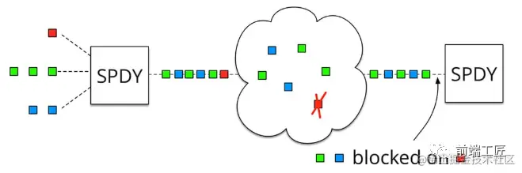
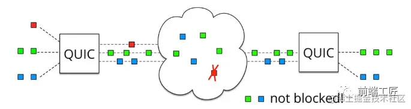
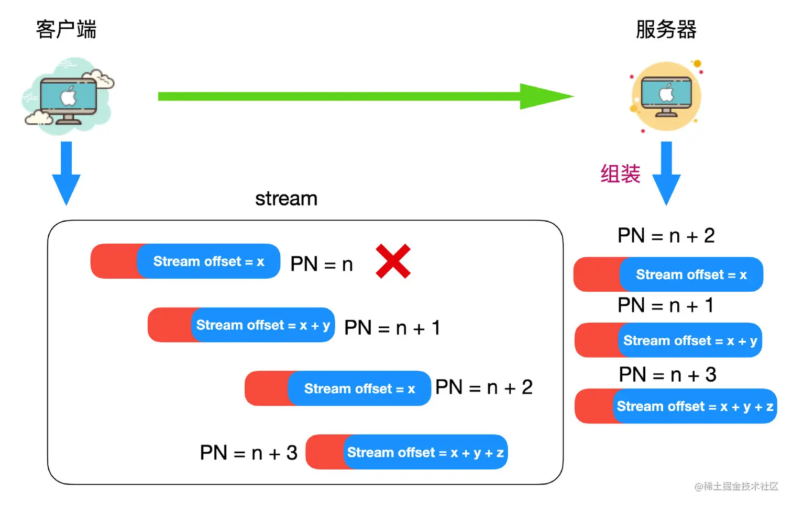

基于 UDP 协议的“QUIC”协议

### 特点

#### 集成了TLS加密功能

目前QUIC使用的是TLS1.3，相较于早期版本TLS1.3有更多的优点，其中最重要的一点是减少了握手所花费的RTT个数。

在完全握手情况下，需要 1-RTT 建立连接。 TLS1.3 恢复会话可以直接发送加密后的应用数据，不需要额外的 TLS 握手，也就是 0-RTT。

#### 0-RTT 建立连接

上面提到的使用TLS1.3,提供的恢复会话的功能,可以使用之前握手过程中得到的密钥和参数，以及之前的会话信息，来尝试建立一个0-RTT连接。

#### 多路复用，彻底解决TCP中队头阻塞的问题

http2中多路复用,可以让多个请求和响应在同一个TCP中进行,但是一个请求有多个帧按顺序接收处理,当其中一个帧丢失时,后续的所有帧会被阻塞,等待丢失的帧重传

只有一条连接,串行传输

QUIC实现了在同一物理连接上可以有多个独立的逻辑数据流（如下图）。实现了数据流的单独传输，就解决了TCP中队头阻塞的问题。

每个请求是单独的数据流

每个包可以乱序传递,到了接收端再按顺序组装

### **连接迁移**

TCP 是按照 4 要素（客户端 IP、端口, 服务器 IP、端口）确定一个连接的。而 QUIC 则是让客户端生成一个 Connection ID （64 位）来区别不同连接。只要 Connection ID 不变，连接就不需要重新建立，即便是客户端的网络发生变化。

## http3.0/QUIC中udp是怎么保证可靠性的

QUIC 通过单向递增的 Packet Number，配合 Stream ID 与 Offset 字段信息，可以支持乱序确认而不影响数据包的正确组装

QUIC 引入了一个 *stream offset* 的概念，一个 stream 可以传输多个 stream offset，每个 stream offset 其实就是一个 PN 标识的数据，即使某个 PN 标识的数据丢失，PN + 1 后，它重传的仍旧是 PN 所标识的数据，等到所有 PN 标识的数据发送到服务器，就会进行重组，以此来保证数据可靠性。到达服务器的 stream offset 会按照顺序进行组装，这同时也保证了数据的顺序性。

