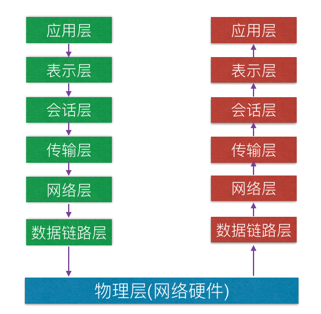

### 基本介绍

七层网络模型是一种将计算机网络分为七个层次的抽象模型，每个层次都有特定的功能和协议，便于不同设备和网络之间的通信和交互。

1. 物理层（Physical Layer）：负责传输比特流，即二进制信号，在物理媒介上进行传输，如电缆、光纤等。
2. 数据链路层（Data Link Layer）：负责将比特流转换成数据帧，管理物理层与网络层之间的传输，实现错误检测和纠正，如以太网、WiFi 等。
3. 网络层（Network Layer）：负责对数据包进行路由选择和转发，实现不同网络之间的通信，如 IP 协议。
4. 传输层（Transport Layer）：负责对传输的数据进行分段、传输和重组，确保端到端的可靠传输，如 TCP、UDP 协议。
5. 会话层（Session Layer）：负责建立、管理和维护两个节点之间的会话和连接
6. 表示层（Presentation Layer）：负责数据格式的转换,加密解密等处理，以便于不同系统之间的通信，如压缩、加密、解密、编码等。
7. 应用层（Application Layer）：负责提供应用程序的接口和协议，使不同应用程序之间可以进行通信，如 HTTP、FTP 等。

七层模型也称OSI(Open System Interconnection)参考模型

### 模型优点

建立七层模型的主要目的是为了解决异种网络互联时所遇到的兼容性问题

最大的优点是将服务,接口和协议这三个概念明确地区分开

服务说明某一层为上一层提供一些什么功能

接口说明上一层如何使用下层的服务

协议涉及如何实现本层的服务

这样各层之间有很强的独立性,互联网络中各个实体采用什么样的协议是没有限制的,只要向上提供相同的服务并且不改变相邻层的接口就可以了

### 七层网络的好处

- 减轻问题复杂度,一旦网络故障,可迅速定位故障所处层次,便于查找和纠错
- 在各层分别定义标准接口,使具备相同对等层次的不同设备能够实现互操作,各层之间则相对独立,一种高层协议可放在多种低层协议上运行
- 能有效刺激网络技术革新,每次更新都可以在小范围内进行,不需要对整个网络动大手术

[(91条消息) 网络七层模型_ShaYX1991的博客-CSDN博客_七层网络模型](https://blog.csdn.net/a369189453/article/details/81193661)

### 每一层的设备

1. 物理层（Physical Layer）：负责传输数据的物理介质和电信号。相关设备包括传输介质（如光纤、铜缆）、中继器（Repeater）和集线器（Hub）。
2. 数据链路层（Data Link Layer）：负责在物理连接上传输数据帧，并提供错误检测和纠正。相关设备包括网桥（Bridge）和交换机（Switch）以太网卡
3. 网络层（Network Layer）：负责数据包的路由和转发，以实现不同网络之间的通信。相关设备包括路由器（Router）和三层交换机（Layer 3 Switch）。
4. 传输层（Transport Layer）：负责数据的可靠传输和端到端的连接。相关设备包括网关（Gateway）和负载均衡器（Load Balancer）。
5. 会话层（Session Layer）：负责建立、管理和终止会话连接。相关设备包括会话控制器（Session Controller）和网关。
6. 表示层（Presentation Layer）：负责数据的格式转换、数据加密和解密。相关设备包括加密设备和数据转换设备。
7. 应用层（Application Layer）：负责提供特定应用程序的功能和服务。相关设备包括Web服务器、邮件服务器、DNS服务器等。