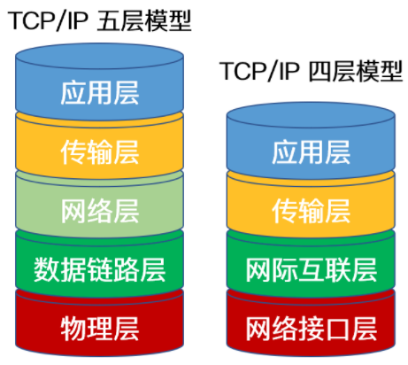

### 是什么

tcp是传输控制协议

ip是网际协议

TCP/IP协议不仅仅指的是`Tcp`,`Ip`两个协议,而是指`TCP,FTP,SMTP,UDP,IP`等协议构成的协议簇

`SMTP`简单邮件传输协议

`UDP`:用户数据报协议

只是因为TCP和IP最具有代表性,所以统称为TCP/IP协议

（英语：TCP/IP Protocol Suite，或TCP/IP Protocols）

### 划分

按层次划分可以划分成五层或者四层体系

五层的从上到下是:应用层,传输层,网络层,数据链路层,物理层

四层的从上到下是:应用层,传输层,网际互联层(网络层),网络接口层

**五层体系只是为了介绍网络原理而设计,实际应用是四层体系结构**

### 五层体系

#### 应用层

应用层将OSI7层模型中的会话层,表示层和应用层的功能合并在一个应用层实现

通过不同的应用层协议为不同的应用提供服务

协议:`FTP,Telnet,DNS,SMTP`

`Telnet`:远程登录协议

#### 传输层

提供端对端的通信能力

两个重要协议:`TCP,UDP`

#### 网络层

将传输层产生的报文段或用户数据封装成分组或包进行传送

协议:`IP,ARP`

`ARP`:地址解析协议

#### 数据链路层

将网络层交下来的IP数据报组装成帧,在两个相邻节点之间的链路上传送帧

