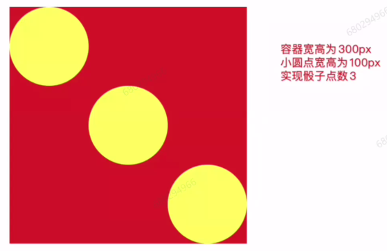

- 实习做了些什么
- 校园经历
- css定位方式,position
- 实现三栏布局
- flex布局
- flex实现骰子中的三点的样式



- 事件循环
- 输出

```js
setTimeout(function() {
    console.log(1)
},0)
new Promise(function(a,b) {
    console.log(2)  
    for(var i = 0; i < 10; i++){
        i == 9 && a()
    }
    console.log(3)
}).then(function() {
    console.log(4)
})
console.log(5)
```

- 看会不会打印

```js
// function foo(){
//     setTimeout(foo,0)
// }
// function foo(){
//     return Promise.resolve().then(foo)
// }
foo() //分别解开上面注释的函数,下面的打印会不会执行
setTimeout(() => {
    console.log('111')
},0)
```

这个不用想太复杂了,就是无限的循环中,第一个都是宏任务可以执行到,第二个是微任务,所以宏任务无法执行

- 跨域问题(被问麻了),原因

- 正向代理和反向代理
- http和https
- 前端安全(xss和csrf)
- 算法:三数之和,不同解法的复杂度
- 重排重绘
- 项目中有做过性能优化吗?怎么发现的性能问题
- 项目问题
- 公司项目有什么问题,让你来设计,你会怎么解决
- 反问
- 技术栈为react,产品是金山文档

